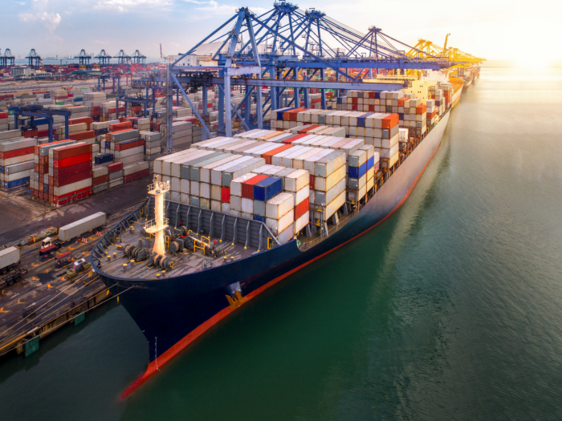
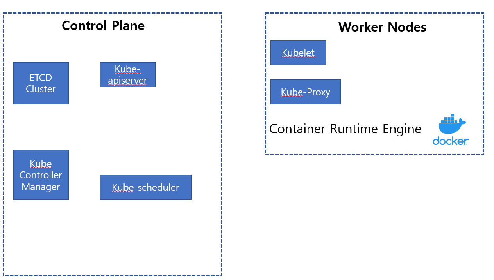

## 1. CKA Core Conecpt

1. Kubernetes 구조



제가 Udemy에서 보고있는 CKA 강좌 Certified Kubernetes Administrator (CKA) with Practice Tests 에서는

Master Node와 Worker Node에 및 Kubernetes에 대한 전반적인 구조를 선박과 연관지어 설명하였습니다.


실질적으로 컨테이너를 운반하는 Cargo Ship을 Worker Node로 연관지어 설명하였고

Cargo Ship을 모니터링 하고 관리하는대한 책임을 지는 Control Ship을 Master Node(Control Plane)에 연관지어 설명하였습니다.

사전적으로 설명하자면 

Master Node(Control Plane) : 워커 노드와 클러스터 내 파드를 관리합니다.

Worker Node: 각기 다른 목적, 기능으로 세분화된 컨테이너들이 실제 배치되는 노드(Application을 서비스하는 Node) 입니다.




위의 그림이 Kubernetes에 대한 전반적인 구성 요소 입니다. 위의 구성요소에 대해 조금 더 자세히 살펴보겠습니다.


2.  Control Plane 구성요소

2-1.  ETCD

위에서 설명드린 컨테이너를 실질적으로 운반하는 CargoShip에서 Control Ship으로 운반한 컨테이너를 적재한다고 가정해봅시다.

일상생활속에서 이러한 컨테이너 운반 작업은 매일매일 발생하는 작업일것입니다.

그래서 관리를 위해 어떤 배에서 어떤 컨테이너가 언제 옮겨졌는지등에 대한 정보를 저장해야할 것입니다.

이것을 위해 필요한것이 바로 ETCD 입니다.

ETCD는 Key-Value 형태로 저장이 되는 데이터베이스 입니다.

2-2.  Kube_Schedulers

Cargo Ship이 도착하여 크레인을 이용하여 컨테이너를 옮긴다고 가정해보겠습니다.

이때 크레인은 컨테이너를 어떤 장소로 옮길지에 대해 검토후 결정하여 알맞은 장소에 컨테이너를 적재합니다.

Kubernetes에서 이 역할을 진행해주는것이 Kube_Schedulers 입니다.

Kube_Schedulers는 새로 생성된 모든 Pod나 예약되지 않은 다른 Pod에 대해 실행할 최적의 Node를 선택해주는 역할을 합니다.

2.3.  Controller-Manager

Control Ship에는 컨테이너의 손상을 담당하는 역할을 하는 팀이 있을겁니다. 만약 컨테이너가 손상이 되거나 하는 이슈가 있으면
새로운 컨테이너를 준비하여 새로운 컨테이너로 교체해주는 역할을 해주는데 Kubernetes 에서는 Controller-Manager가 해당 역할을 수행합니다.

Controller-Manager
- Node-Controller : 노드가 다운되었을 때 통지와 대응에 대한 역할(Pod의 재생성 등의 작업을 진행한다.)
- Replication-Controller : 시스템의 모든 레플리케이션 컨트롤러 오브젝트에 대해 알맞은 수의 Pod를 유지시키는 역할

2.4.  Kube-ApiServer
위에서 설명드린 Control Ship의 다양한 역할을 해주는 팀들끼리의 의사소통을 도와주는 팀이 있습니다.
Kubernetes에서는 이 역할을 Kube-ApiServer가 진행하고 있습니다.

Kube-ApiServer는 쿠보네티스에 있어서 가장 중요한 역할을 담당하고 있습니다.
마스터 노드의 중심에서 들어오는 모든 요청을 전부 처리해주는 역할을 합니다.


3.  Worker Node 구성요소

3-1.  Kubelet

모든 CargoShip에는 각각 선장이 있습니다. 이 선장은 Control Ship의 지시를 듣고 컨테이너를 적재하는 등의 작업을 진행하는데
Kubernetes 에서는 이 역할을 Kubelet이 수행합니다.

Kubelet은 클러스터의 각 노드에서 실행되는 에이전트, Kubelet은 파드에서 컨테이너가 확실하게 동작하도록 관리한다.

3-2.  KubeProxy

많은 CargoShip들이 서로간에 다른 역할을 가지고있으며 서로간의 통신하여 합동하고 각자 맡은 역할을 수행합니다.
Kubernetes 에서는 KubeProxy가 해당 기능을 수행합니다.

KubeProxy는 Worker Node에서 실행중인 컨테이너가 서로 연갈할 수 있도록 필요한 규칙이 Worker Node에 적용되도록 합니다.


```toc

```
