## 👋 Azure Devops  

지난번에 AKS 및 ACR 생성에 이어서 DevOps에서 Pipeline 구축을 진행해보도록 하겠습니다.

## 🚀 시작하기

https://devops.azure.com/ 에 접속하셔서 로그인을 하시면 

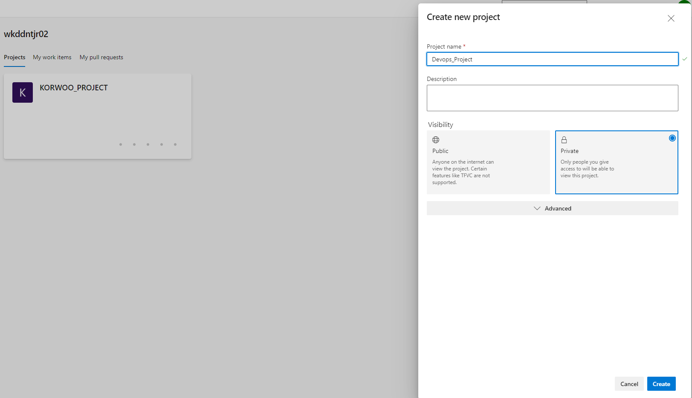

과 같은 프로젝트 생성 화면을 보실 수 있습니다.
프로젝트의 이름 및 공개 여부를 설정해주시고 DevOps 프로젝트를 생성하도록 하겠습니다.

## Azure Devops Git

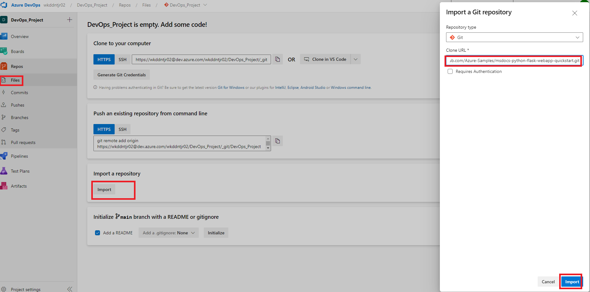

Azure Devops 왼쪽에 Repos라는 메뉴가 있습니다.
이 메뉴는 Azure Devops에서 제공하는 Git Repository 입니다.
이는 표준 Git을 채택하여 사용하기에 기존 사용하시던 GitHub와 동일하게 사용하실 수 있습니다.
여기서 저는 Azure에서 기본적으로 제공해주는 Python Flask 샘플앱
(https://github.com/Azure-Samples/msdocs-python-flask-webapp-quickstart.git) 을 Import 해보도록 하겠습니다.

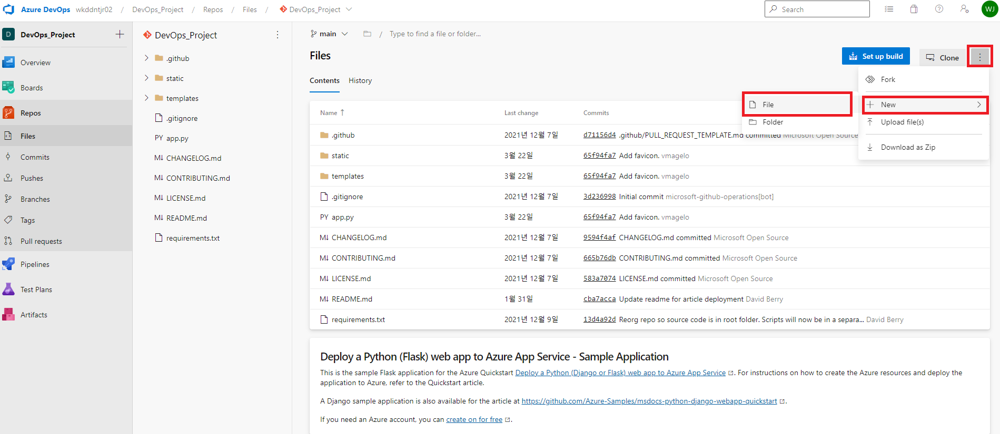

Import가 성공적으로 완료되면 다음과 같은 화면을 보실 수 있습니다.
여기서 저희는 이 Flask App을 컨테이너로 Build & Push 해야하기에 Dockerfile 파일을 추가해주겠습니다.

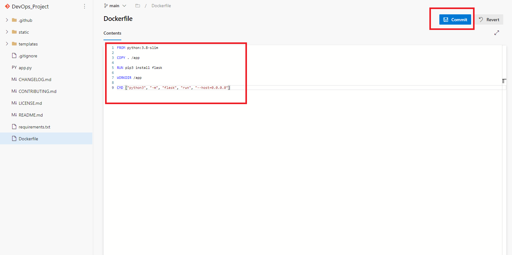

``` Dockerfile

FROM python:3.8-slim

COPY . /app

RUN pip3 install flask 

WORKDIR /app

CMD ["python3", "-m", "flask", "run", "--host=0.0.0.0"]

```

해당 DockerFile 내용을 Git에 Commmit 해주겠습니다.


## Azure Devops pipeLine

이제 본격적으로 생성하였던 Azure Container Registry에 Build & Push 해주기 위한 PipeLine 작업을 진행하겠습니다.

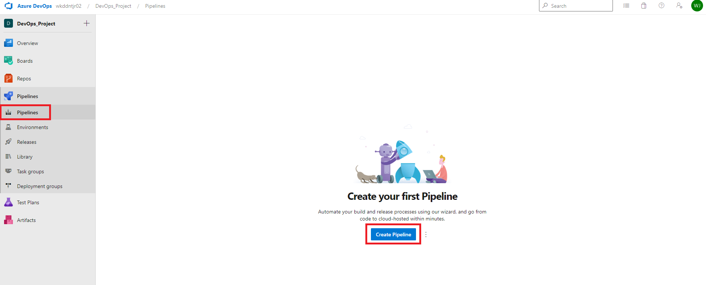

왼쪽에 보이는 pipelines 에서 Create Pipeline을 선택하여 들어갑니다.

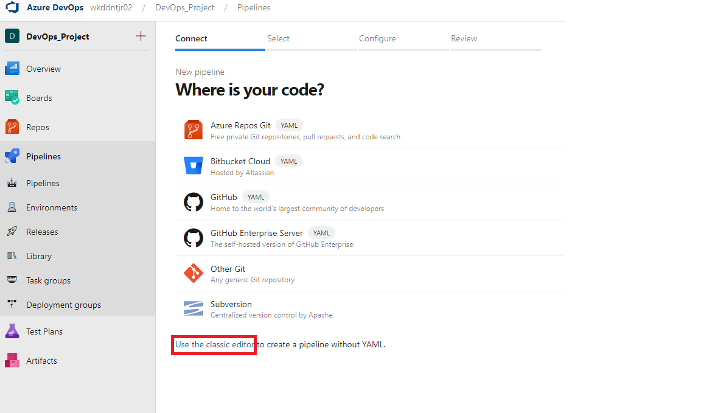

하단에 보이는 Use the Classic Editor 를 선택합니다.

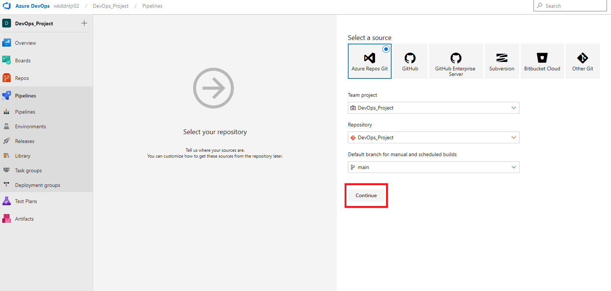

저희가 사용하는 Azure Repos Git을 선택해줍니다.

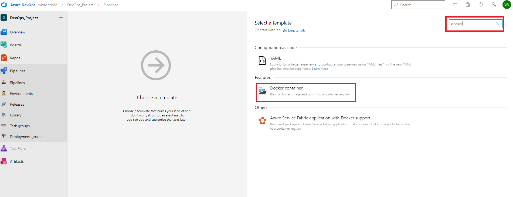

Docker Build & Push 를 위해 상단에서 Docker를 검색 후 나오는 Docker Container을 선택해줍니다.

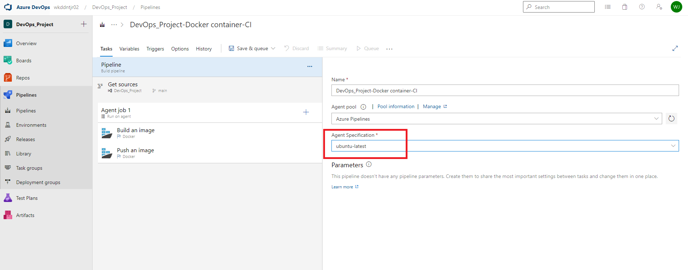

Agent Specificastion 은 어떤 운영체제가 PipeLine을 실행시켜주느냐 인데 저는 ubuntu 로 선택을 하였습니다.

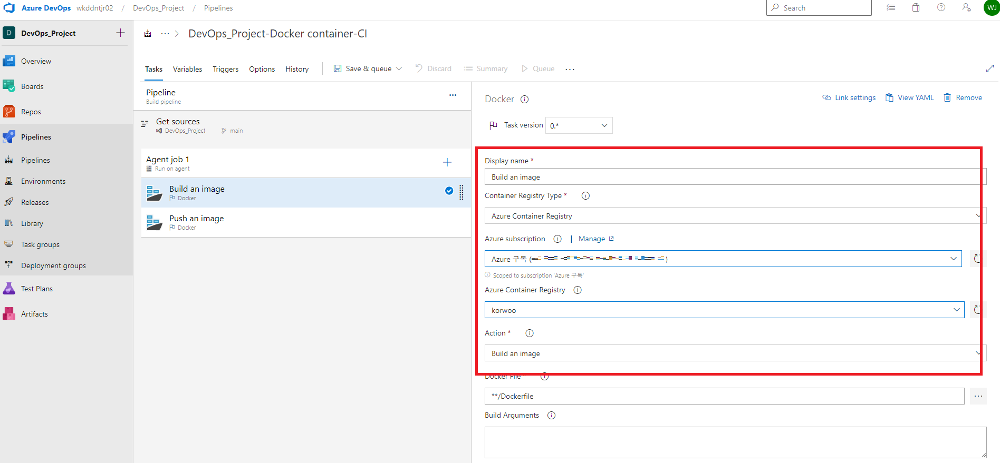

보이시는 Docker Build 에서 AKS 및 ACR을 생성하였던 구독, 생성한 ACR을 선택해줍니다.
바로 아래 보이는 Docker Push 또한 Docker Build 와 동일하게 선택해줍니다.

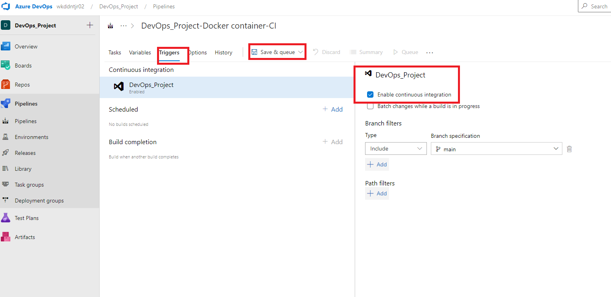

상단의 Triggers 에 접속하여 Enable Continous Integration을 체크해줍니다.
이것을 선택해 주면 해당 Git에 Commit & Push 하였을때 이것을 감지하고 자동적으로 Docker Build & Push 작업을 진행해주는 기능입니다.
활성화 후 Save & Queue를 선택하여 저장 및 실행해주도록 합니다.

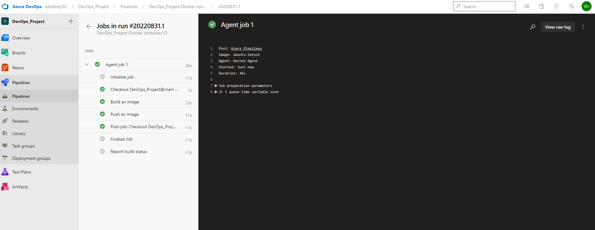

PipeLine에 메인메뉴에서 위의 화면과 같이 작업이 잘 진행되고 있는지 확인하실 수 있습니다.
위의 화면에서 작업이 잘 완료되었다고 하니 ACR로 이동하여 이미지가 잘 Build 및 배포가 되었는지 확인해보도록 하겠습니다.

# Container 확인작업

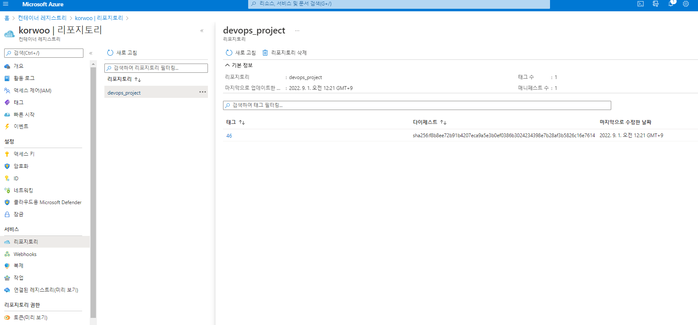

Azure Portal로 이동하여 ACR -> 리포지토리 로 이동하면 위의 그림과 같이 컨테이너 이미지가 잘 배포되었음을 확인할 수 있습니다.
이제 이 컨테이너 이미지가 정상적인지 확인해 보겠습니다.

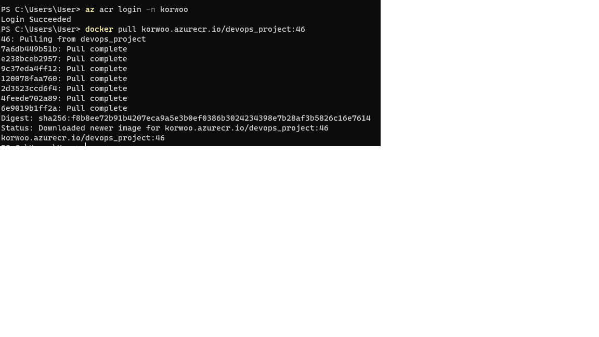

터미널에 접속하여 먼저 az acr login -n ACRNAME 을 입력하여 ACR에 로그인을 해줘야합니다. 다음 배포된 이미지를 당겨옵니다.

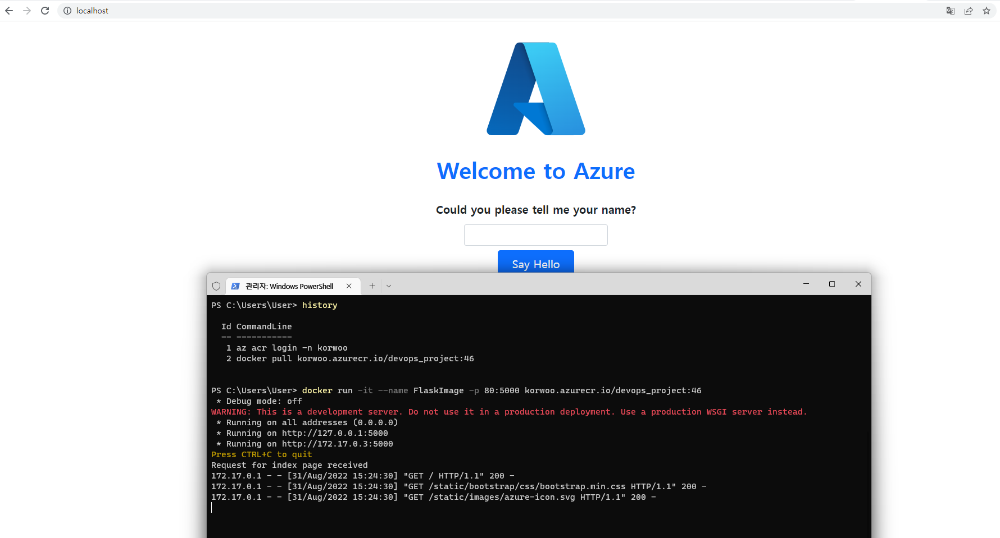

저는 여기서 Docker run -it --name FlaskTest -p 80:5000 Container Image Name:version 
과 같은 방식으로 입력하여 FLask 테스트를 진행하였고 LocalHost로 접속해보니 정상적으로 잘 작동하였음을 확인하였습니다.
다음에는 이 이미지를 AKS로 배포해보도록 하겠습니다.


```toc

```
