## 👋 1. AKS 소개

AKS(AzureK Kubernetes Service)는 Azure 에서 제공하는 컨테이너 기반 인프라 운영 서비스입니다. Master 서버를 Azure 에서 관리해 주기에
인프라 관리 부담은 줄어들고 Azure 리소스와의 뛰어난 호환성을 가지고 있습니다. 또한 Azure CNI(Container Network Interface) 를 활용하여
AKS에서 생성된 Pod와 Azure VNet 상의 리소스를 직접 통신시킬 수 있습니다.  🙌


> 혹시 만드시는 과정에서 궁금하신 점이나 어려움이 있으시다면 [이슈](https://github.com/zoomKoding/zoomkoding-gatsby-blog/issues/new)를 통해 문의 남겨주세요!  
> [스타](https://github.com/zoomKoding/zoomkoding.com)는 블로그 테마를 지속적으로 발전시키는데 큰 힘이 됩니다!⭐️

## 🚀 시작하기

1.  Azure Portal에 로그인하여 상단의 검색바에서 Kubernetes & AKS 를 검색합니다.
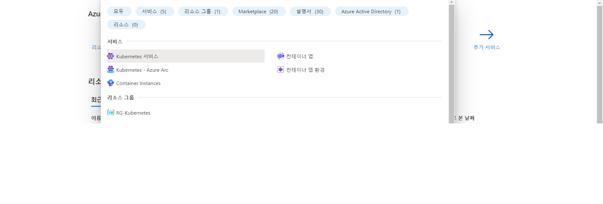 

2.  상단 +만들기 에서 Kubernetes 클러스트 만들기 를 클릭합니다.
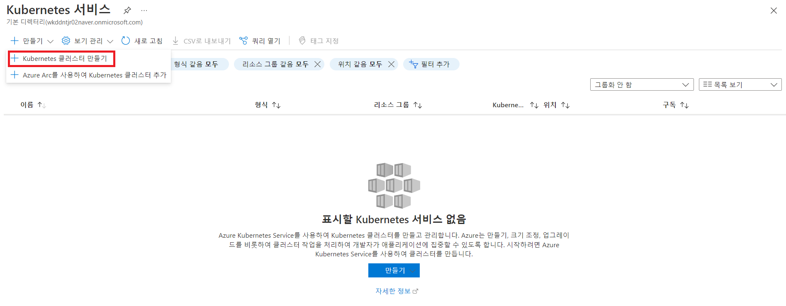

3.  AKS 생성 상세 메뉴 입니다. 먼저 AKS를 배포할 리소스 그룹을 생성해줍니다. 리소스 그룹 부분에 새로 만들기를 클릭하여 리소스 그룹 이름을 지정해줍니다. 리소스 그룹 이름은 규칙성 있게 지정해주는 편이 나중에 햇갈리지 않습니다.

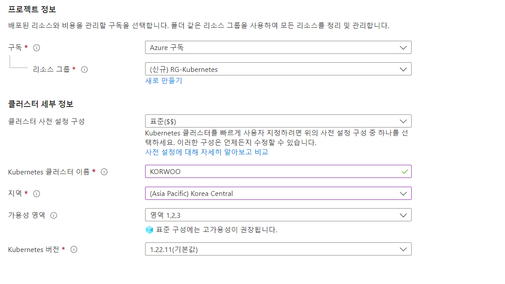

클러스터 사전 설정 구성은 AKS의 목적에 따라 표준, 개발/테스트, 비용 최적화, 일괄 처리, 강화된 액세스 로 나뉘어 집니다. 
일반적인 실습이 목적이라면 표준 & 개발/테스트 로 선택해줍니다. 본 실습에서는 표준으로 선택하고 진행하겠습니다.

Kuberbetes Cluster 의 이름은 구독 내에서 유일한 이름으로 지정해줍니다.

지역은 사용자가 위치한 지역에 알맞게 설정해줍니다.

가용성 영역은 기본 3개로 지정되어있습니다.

여기서 가용석 영역이란 예를들어 현재 AKS를 만들고자 하는 한국 중부 리전에 지진,홍수 등 데이터 센터에 문제가 생겼을 시에 대비하여

물리적으로 구분되어 전력적으로 배치된 데이터 선터를 최소 3개 이상 연결하는 지역 네트워크 설계를 통해 단일 실패 지점을 제거하는 방식 입니다.

노드 크기는 AKS를 위해 존재하는 VMSS(Virtual Machine Scale Set) 의 성능(SKU)을 의미합니다. 이 또한 기본값으로 지정된 DS2 v2로 지정합니다.

4.  인증 및 권한 부여 부분은 기본적으로 설정되어 있는 Kubernetes RBAC가 있는 로컬 계정으로 선택합니다. 이것이 의미하는 바는 

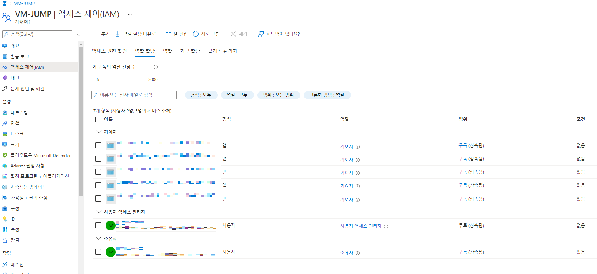

Azure 에서 제공되는 리소스에는 액세스 제어(IAM) 탭이 있습니다. 이 IAM에 명시되어 있는 사용자들에게 한해 접근 권한을 부여한다는 뜻 입니다.

5.  네트워킹 설정 탭 입니다. 

네트워크 구성은 kubenet 과 Azure CNI 로 나뉘어 집니다. Kubenet은 기본 네트워킹 Azure CNI는 고급 네트워킹 입니다.
간단하게만 보면 kubenet은 AKS에 필요한 가상 네트워크 대역폭을 자동으로 지정해주고
Azure CNI는 사용자가 직접 가상네트워크의 대역폭을 설정해줄 수 있습니다.

Azure CNI와 kubenet를 비교하는 표 입니다.

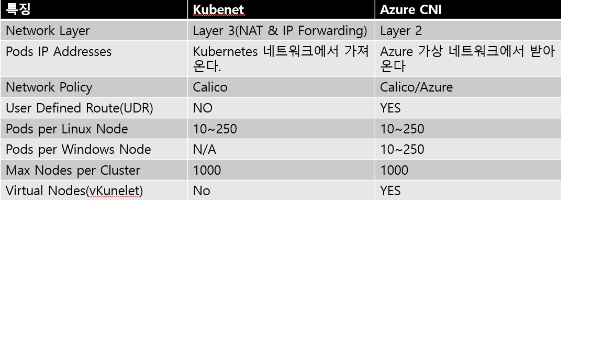

정리하자면

Kubenet이 권장되는 경우
-> 제한된 IP 주소 공간
-> 대부분의 Pod 통신이 Cluster 내에 있을때
-> 가상 노드와 같은 기능 사용 XX

Azure CNI 가 권장되는 경우
-> 가상 노드 또는 네트워크 정책과 같은 고급 보안 기능 필요
-> Pod 통신이 Cluster 외부의 리소스일때
-> 직접적인 IP 주소 할당이 필요할때

로 정리하였습니다. 본 실습에서는 kubenet로 지정하겠습니다.

AKS 에 배포된 애플리케이션에 쉽게 액세스 하기 위하여 HTTP 애플리케이션 라우팅 사용을 체크해줍니다.

AKS 보안 설정을 위해 Calico 설정을 할 수 있습니다. 이 실습에서는 사용하지 않겠습니다.

6. 통합 탭 입니다.

추후 Azure Devops에서 이미지를 Build & Deploy 할 ACR(Azure Container Registry)를 생성하겠습니다.

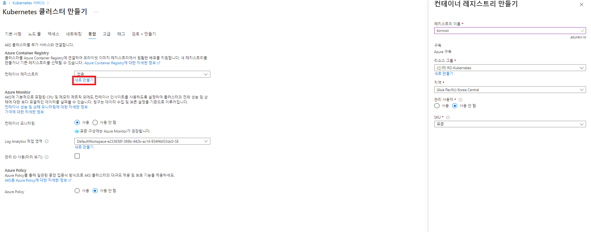

컨테이너 레지스트리 탭에서 새로만들기를 클릭후 ACR이름을 지정하여 생성해줍니다. 이때 ACR의 이름은 Azure 전체에서 유일한 이름이어야합니다.

7. 최종

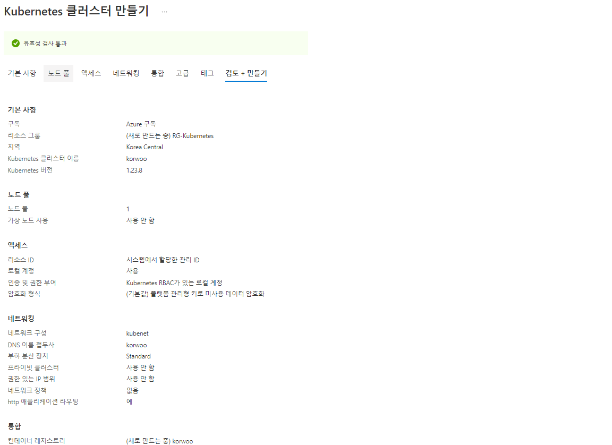

설정한 내용들을 최종적으로 검토하고 하단의 만들기를 클릭하여 리소스를 생성합니다.

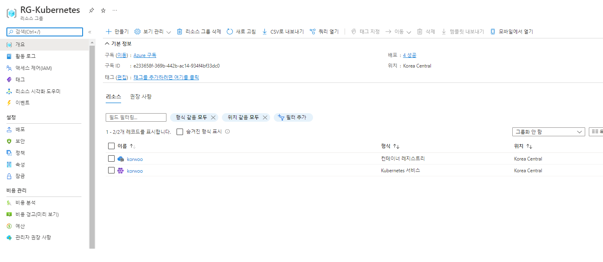

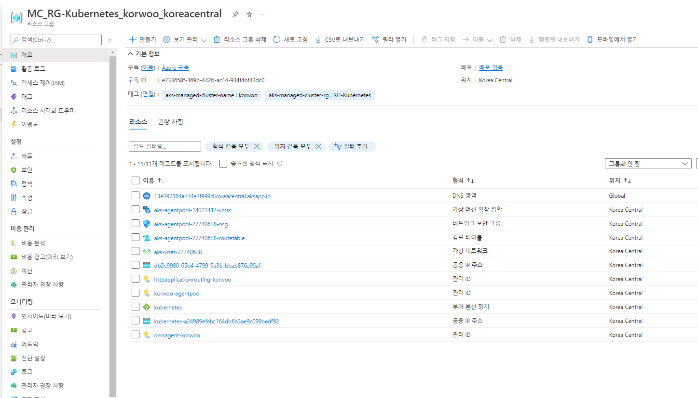

생성된 리소스를 확인합니다.

8. AKS 접속 테스트

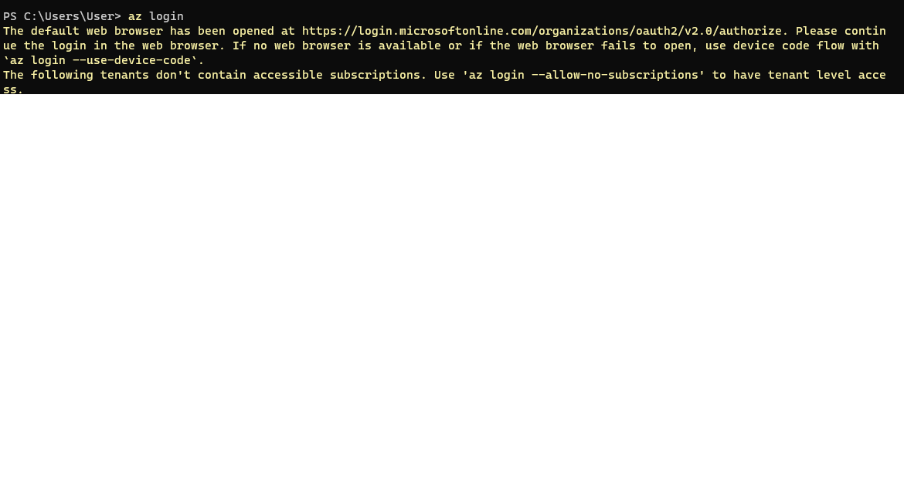

Window의 경우 PowerShell에서 Az login 을 입력하여 Azure 계정으로 login 합니다.
(Azure CLI 설치 필요!!)

- az account set --subscription subscriptionid 를 입력하여 AKS가 생성된 구독 ID를 지정합니다.

- az aks get-credentials --resource-group RG-Kubernetes --name korwoo

를 입력하여 AKS의 Credential를 Get 합니다.

- kubectl get namespaces 등의 명령어를 입력하여 AKS를 테스트 합니다.

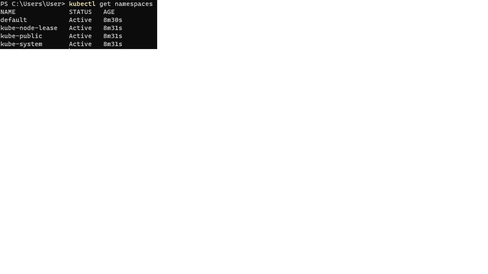


```toc

```
