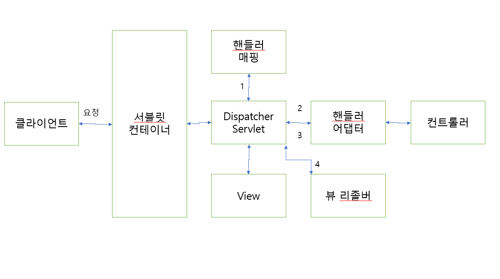

## 1. Spring Boot 동작 방식

스프링 부트에서 Spring-boot-starter-web 모듈을 사용하면 기본적으로 Tomcat을 사용하는 스프링 MVC 구조를 기반으로 동작합니다.




서블릿 : 클라이언트의 요청을 처리하고 결과를 반환하는 자바 웹 프로그래밍 기술

서블릿 컨테이너 : HTTP 요청을 받아 웹페이지를 동적으로 생성하는 역할을 합니다. 
서블릿 인스턴스를 생성하고 관리하는 역할을 수행하는 주체,
Ex) Tomcat

서블릿 컨테이너의 특징
- 서블릿 객체를생성, 초기화, 호출, 종료하는 생명주기 관리
- 서블릿 객체는 싱글톤 패턴으로 관리
- 멀티 스레딩 지원


스프링에서는 DispatcherServlet이 서블릿의 역할을 수행합니다. 서블릿 컨테이너와 DispatcherServlet은 자동 설정된 web.xml의 설정값을 공유합니다.

동작 원리
1.  DispatcherServlet으로 요청(HttpServletRequest)이 들어오면 DispatcherServlet은 핸들러 매핑을 통하 요청 URI에 매핑된 핸들러를 탐색합니다.
2.  핸들러어댑터로 컨트롤러를 호출합니다.
3.  핸들러 업댑터에 컨트롤러의 응답으 돌아오면 ModelAndView로 응답을 가공해 반환합니다.
4.  뷰 형식으로 리턴하는 컨트롤러를 사용할 때는 뷰 리졸버를 통해 뷰를 받아 리턴합니다.


  


```toc

```
