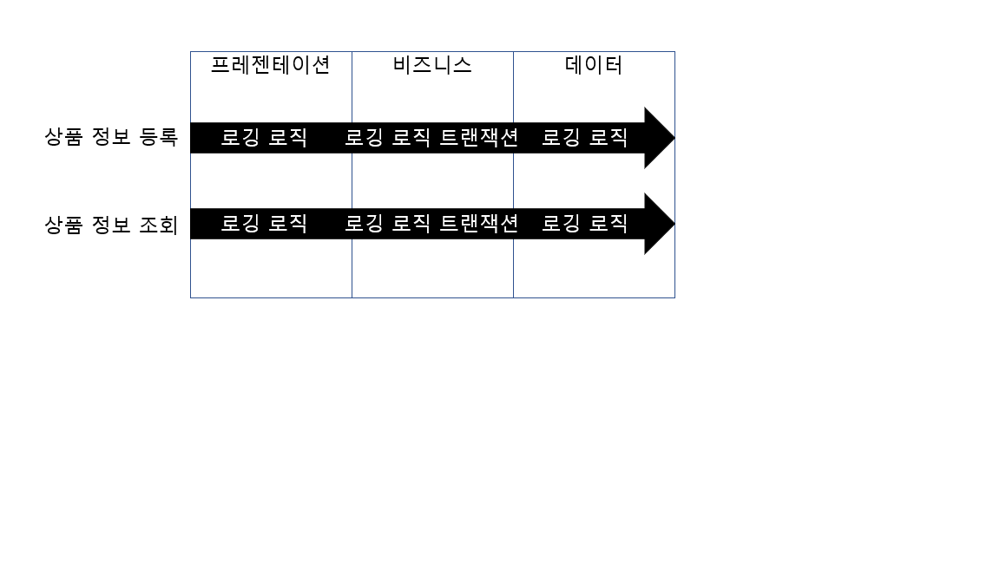

## 1. Spring의 특징

1.  제어 역전(IoC)
  제어 역전(Inversion of Control) 을 특징으로 하는 스프링은 기존 자바 개발 방식과 다르게 작동합니다.
  IoC를 적용한 환경에서는 사용할 객체를 직접 생성하지 않고 객체의 생명주기 관리를 외부에 위임합니다.
  외부는 스프링 컨테이너, IoC 컨테이너를 의미합니다.

  객체의 관리를 외부에 맡겨 제어권이 넘어간 것을 제어 역전이라고 하며, 제어 역전을 통해 의존성 주입(Dependency injection),
  관점 지향 프로그래밍(Aspect_Oriented Programming) 등이 가능해집니다.

2.  의존성 주입(DI)
  의존성 주입(Dependency Injection)이란 제어 역전의 방법 중 하나로, 사용할 객체를 직접 생성하지 않고 외부 컨테이너가 생성한 객체를 주입받아
  사용하는 방식을 의미합니다.
  - 의존성 주입방법

  2-1.  생성자를 통한 의존성 주입
  ``` java
  @RestController
  public class DIController
  {
    MyService myService;
    @Autowired
    public DIController(Myservice myService)
      {
      this.myService=myService;
      }

        @GetMapping("/di/hello")
        public String hetHello()
        {
          return myService.getHello();
        }
  }
  ```

  2-2.  필드 객체 선언을 통한 의존성 주입
  ``` java
  @RestController
  public class FieldInjectionController
  {
    @Autowired
    private MyService myService;
  }

  ```
  2-3.  setter 메서드를 통한 의존성 주입
  ``` java
  @RestController
  public class SetterInjectionController
  {
    MyService myService;

    @Autowired
    public void setMyService(MyService myService)
    {
      this.myService=myService;
    }
  }
  ```

  3.  관점 지향 프로그래밍(AOP)
    관점 지향 프로그래밍(Aspect-Oriented Programming)은 스프링의 아주 중요한 특징입니다.
    AOP는 관점을 기준으로 묶어 개발하는 방식을 의미합니다. 관점이란 어떤 기능을 구현할 때 그 기능을 핵심기능과 부가기능으로 구분하여
    각각을 하나의 관점으로 보는 것을 의미합니다.

    핵심기능은 비즈니스 로직을 구현하는 과정에서 비즈니스 로직이 처리하려는 목적 기능을 말합니다.
    Ex) 클라이언트로부터 상품 정보 등록 요청을 받아 DB에 저장, 그 상품 정보를 조회하는 비즈니스 로직을 구현한다면, 핵심기능은
    1) 상품 정보를 DB에 저장하고,
    2) 저장된 상품 정보 데이터를 보여주는 코드
    입니다.
    
    여기서 핵심 기능에 부가 기능을 추가해야 하는 상황이 발생할 수 있습니다.
    핵심 기능인 비즈니스 로직 사이에 로깅 처리를 하거나 트랜잭션을 처리하는 코드가 예시입니다.

    

    객체 지향 방식의 애플리케이션 로직에서는 위의 그림과 같이 객체마다 핵심 기능을 수행하기 위한 로직과 함께 부가 기능인 로깅, 트랜잭션 등의
    코드를 작성합니다. '상품 정보 등록' 과 '상품 정보 조회' 는 엄연히 다른 기능으로 각자 로직이 구현되어 있습니다.
    하지만 동일한 기능을 수행할 확률이 높습니다. 즉, 핵심기능을 구현한 두 로직에 동일한 코드가 포함됨을 의미합니다.

    

    AOP의 관점에서는 부가 기능은 핵심 기능이 어떤 기능인지에 무관하게 로직이 수행되기 전 또는 후에 수행되기만 하면 됩니다.


```toc

```
