가시다님 스터디 : https://www.notion.so/gasidaseo/23-7635cc4f02c04954a3260b317588113e


## 1. KOPS란??

`K`ubernetes `Op`eration`s`

KOPS 란 쉽게 설명하자면 쿠버네티스의 생성 및 관리를 쉽게 하도록 도와주는 오픈소스 툴 입니다.
쿠버네티스 클러스터를 간단한 CLI 명령을 통하여 생성,관리, 업그레이드 등의 작업을 할수 있도록 지원해줍니다.

`https://kops.sigs.k8s.io/` KOPS 공식 사이트

공식사이트에서 보면 현재 AWS와 GCP가 공식지원되며 Azure는 알파 지원이 가능하다고 명시되어 있는데
Azure도 빨리 공식 지원이 됬으면 좋겠습니다..

## 2. 실습환경 구성을 위한 사전 준비 사항

1. AWS Free Tier 계정
2. IAM User
3. AWS Route53 퍼블릭 호스팅 영역

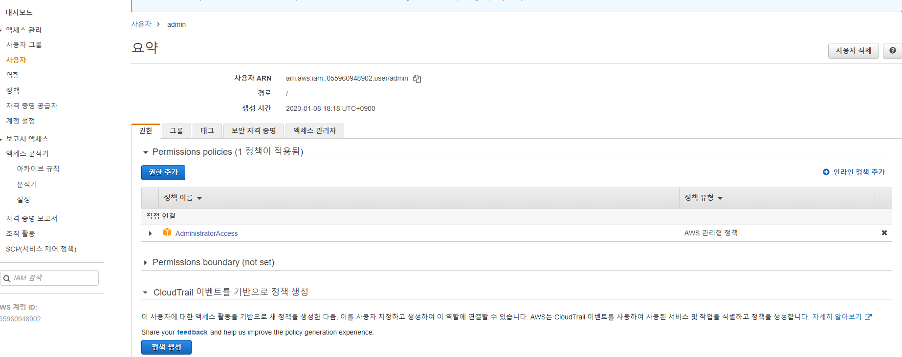

먼저 위의 화면과 같이 AdministratorAccess 정책이 부여된 별도의 계정을 생성해주도록 합니다.

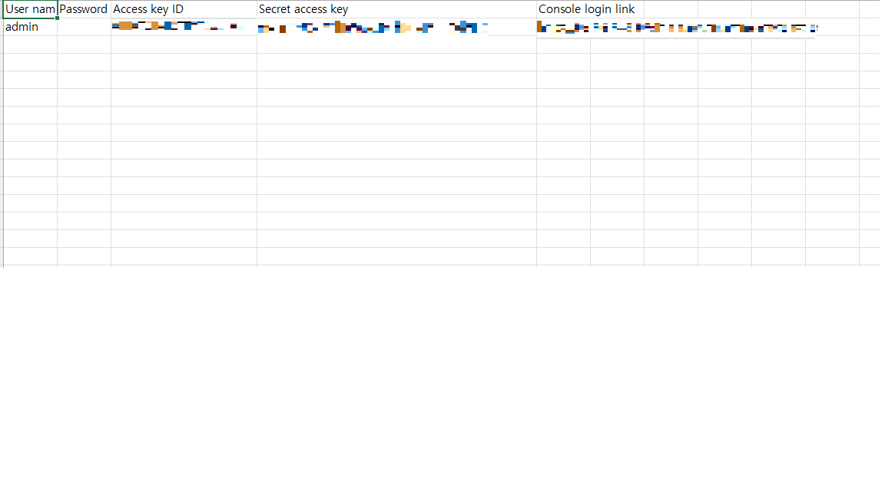

계정을 생성하면 위의 화면과 같이 Access Key ID, Secret Access Key가 제공되는데 해당 값을 이용하여 AWS CLI 로그인을 진행하게 됩니다.
해당 값들이 유출되게 된다면 해킹으로 인하여 폭탄과금이 부여될 수 있으므로 보안에 유의하여 관리해주시길 바랍니다.

## 3. 초기 구성  kops 설치


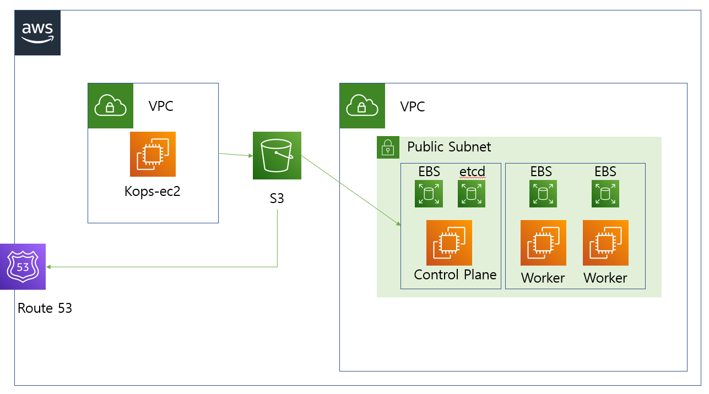

Cloudformation에 이미 작성되어 있는 yaml 파일을 이용하여 기본 인프라 환경이 배포됩니다.

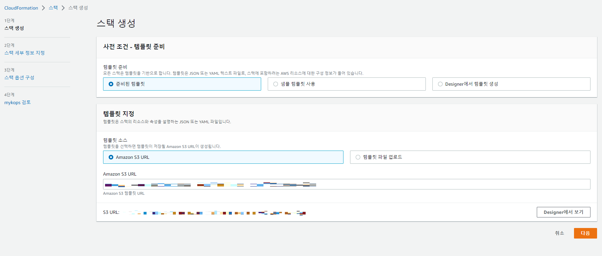

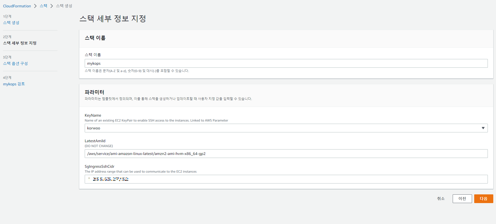

Cloudformation 을 이용한 배포 시 위의 화면 맨 밑에 해당하는 부분에 자신의 IP 주소를 입력하여 (0.0.0.0/0 형태) 보안성을 강화합니다.

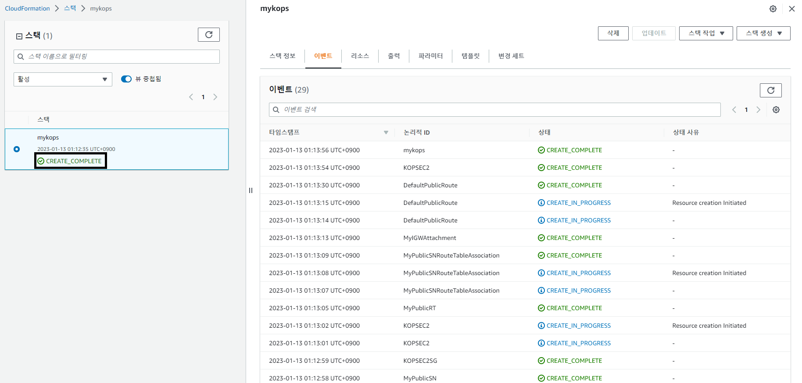

Cloudformation이 완료된다면 위의 화면과 같이 `CREATE_COMPLETE` 라는 문구를 보실 수 있습니다.

그 후 EC2에 접속하시면 생성된 EC2를 확인하실 수 있을겁니다.

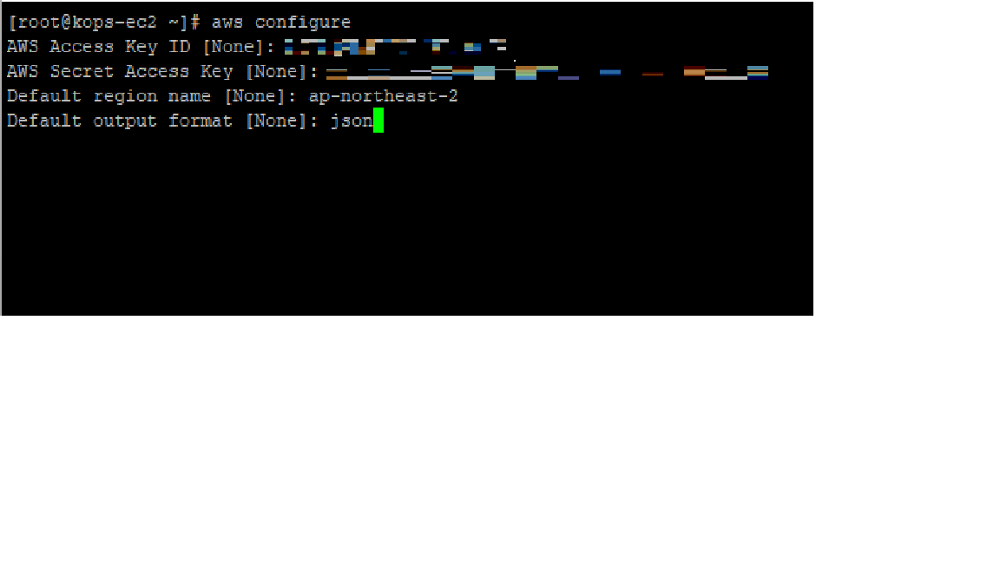

EC2에 접속 후  IAM 자격 증명을 위해
aws configure를 입력하면
AWS Access Key ID,
AWS Secret Access Key
Default region name
등을 입력하실 수 있습니다.
여기서 위에서 생성하였던 IAM 계정의 정보를 입력해주면 자격을 가져오실 수 있습니다.


그 후

```aws s3 mb s3://자신의고유s3이름```

명령어를 통하여 k8s 설정 파일이 저장될 s3 버킷을 생성해주도록 합니다.

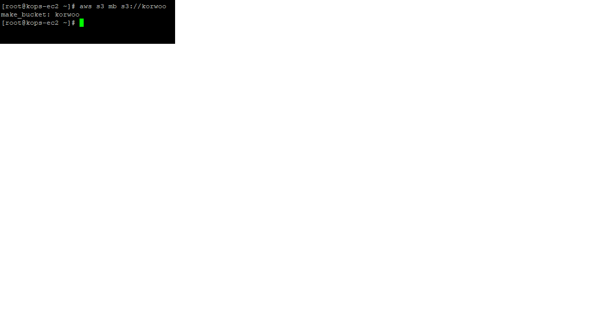


아래의 기본설정 변수를 지정해 줍니다.
```
export AWS_PAGER=""
export REGION=ap-northeast-2
export KOPS_CLUSTER_NAME=korwoo.com #자신의 퍼블릭 호스팅 메인 주소
export KOPS_STATE_STORE=s3://korwoo #자신이 생성한 버킷 이름 
echo 'export AWS_PAGER=""' >>~/.bashrc
echo 'export REGION=ap-northeast-2' >>~/.bashrc
echo 'export KOPS_CLUSTER_NAME=korwoo.com' >>~/.bashrc
echo 'export KOPS_STATE_STORE=s3://korwoo' >>~/.bashrc
```

다음 아래의 명령어를 입력하여 k8s cluster를 배포하도록 합니다.
```
kops create cluster --zones="$REGION"a,"$REGION"c --networking amazonvpc --cloud aws \
--master-size t3.medium --node-size t3.medium --node-count=2 --network-cidr 172.30.0.0/16 \
--ssh-public-key ~/.ssh/id_rsa.pub --name=$KOPS_CLUSTER_NAME --kubernetes-version "1.24.9" -y
```

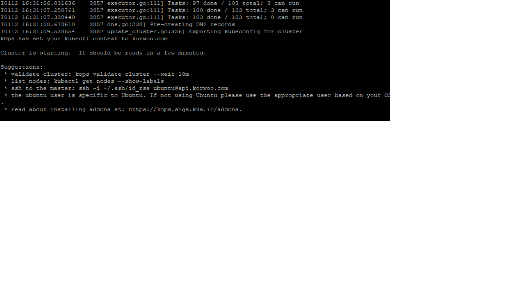

k8s cluster 가 성공적으로 배포되었다면 위의 화면과 같은 메세지를 보실 수 있습니다.

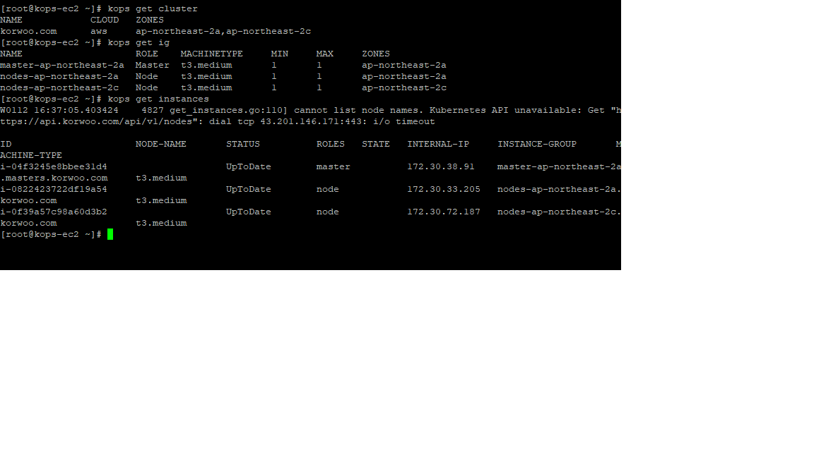

과제 1
```
kops get cluster
kops get ig
kops get instances
```

해당 명령어를 입력하여 정상적으로 설치가 되었는지 확인해주도록 합시다.


다음은 K8S의 플러그인들을 관리해주는 패키지 매니저 krew를 설치해주도록 하겠습니다.

```
curl -fsSLO https://github.com/kubernetes-sigs/krew/releases/download/v0.4.3/krew-linux_amd64.tar.gz
tar zxvf krew-linux_amd64.tar.gz
./krew-linux_amd64 install krew
tree -L 3 /root/.krew/bin

export PATH="${PATH}:/root/.krew/bin"
echo 'export PATH="${PATH}:/root/.krew/bin"' >>~/.bashrc

```

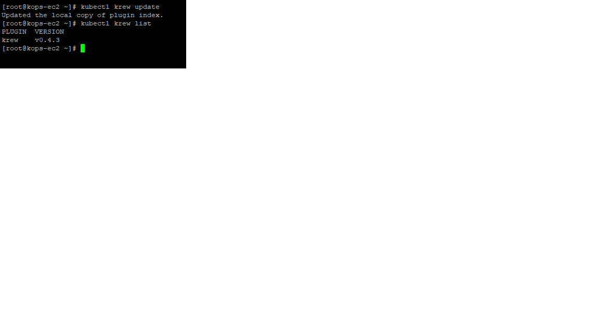

krew 또한 정상적으로 설치되었습니다.


## 4. 이정훈님의 집필 과정 및 AWS EKS 구성 현황 발표

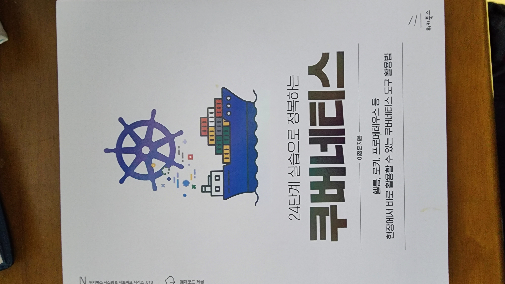

해당 세션은 24단계 실습으로 정복하는 쿠버네티스 의 저자이신 이정훈님께서 실무에서 배우고 느낀점을 집필하시면 느끼셨던점을 공유해주셨던 시간이었습니다.
저는 항상 이런분들을 보면서 자기자신을 반성하게 되는 계기가 되는거 같습니다.
2023년에는 좀더 열심히 달려가야겠습니다!

## 5. Mario 게임 배포 테스트 with CLB

해당 명령어를 사용하여 마리오 디플로이먼트를 배포해보겠습니다.

```
curl -O https://raw.githubusercontent.com/gasida/PKOS/main/1/mario.yaml
kubectl apply -f mario.yaml
cat mario.yaml | yh
```

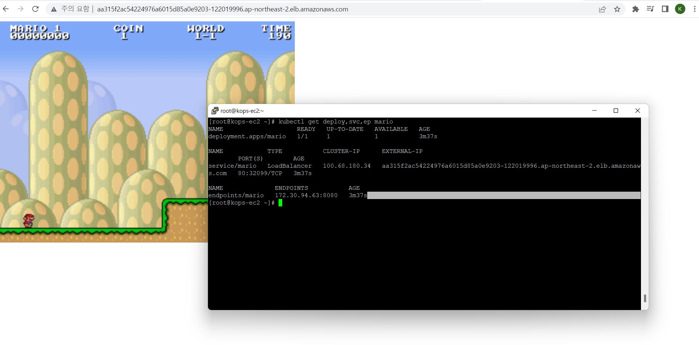

kubectl get deploy,svc,ep mario 를 입력하면
CLB 주소가 나오며 접속하실 수 있습니다.

## 6. Helm 을 이용한 워드프레스 배포

내용 작성 중

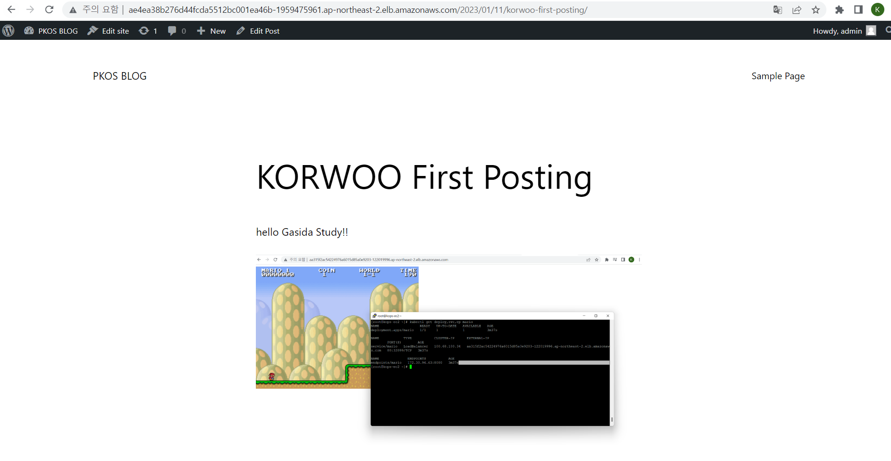

## 7. 과제 3

내용 작성 중
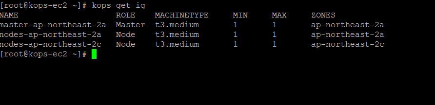
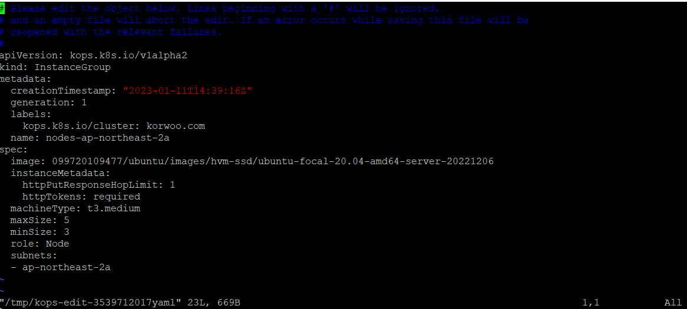
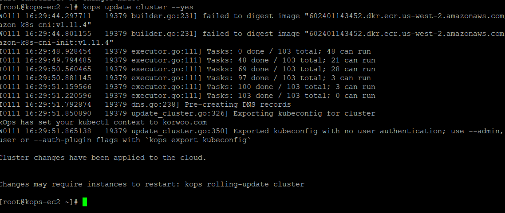
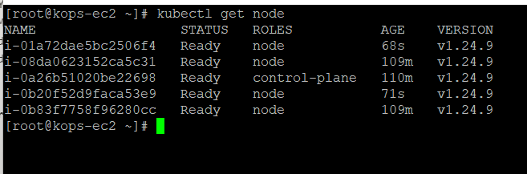


```toc

```


```toc

```
