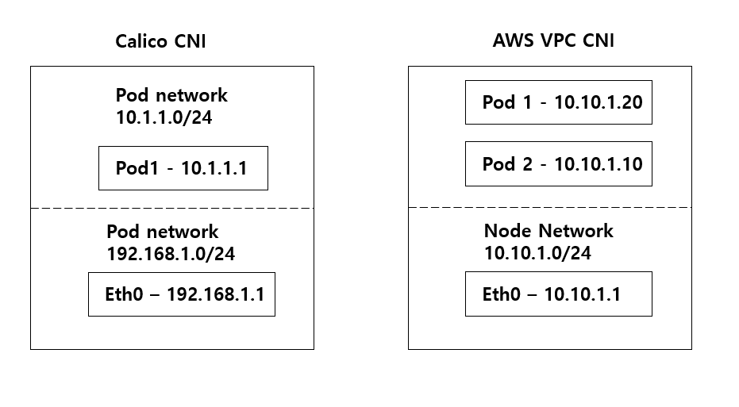

가시다님 스터디 : https://www.notion.so/gasidaseo/23-7635cc4f02c04954a3260b317588113e

가시다님의 쿠버네티스 스터디 2주차 쿠버네티스 네트워크 입니다.
이번주차는 저를 포함한 이번 스터디를 수행하는 모든 문들이 어려움을 많이 느꼈던것으로 알고 있습니다.
저역시 쉽지 않아서 원래대로 라면 지난주에 포스팅해야했을것을 과제만 우선 제출하고 현재 포스팅을 하고 있습니다.ㅜㅜ


## 1. KOPS 원클릭 배포
지난번 1주차에서 스터디장님인 가시다님이 제공해주신 CloudFormation을 통해 EC2등을 배포하고
거기서 aws configure 등의 작업을 진행해 주었습니다.
하지만 가시다님의 노력으로 인하여 저희는 몇줄의 명령어 만으로 쉽게 배포할 수 있게 되었습니다.

kops 원클릭 배포

원클릭 배포를 위해서는 먼저 SSH 키페어, IAM 계정 키, S3 버킷이 필요합니다.

위에서 말씀드린 것들은 1주차에서 생성하였으므로 이번 포스팅에서는 생략하겠습니다.

먼저 cloudformation에서 사용할 yaml 파일이 필요합니다.
``` curl -O https://s3.ap-northeast-2.amazonaws.com/cloudformation.cloudneta.net/K8S/kops-oneclick.yaml ```

해당 파일을 다운받았다면 아래 명렁어를 통하여 배포해줍니다.

``` aws cloudformation deploy --template-file kops-oneclick.yaml --stack-name mykops --parameter-overrides KeyName=본인의 키페어 이름 SgIngressSshCidr=$(curl -s ipinfo.io/ip)/32  MyIamUserAccessKeyID=액세스키 MyIamUserSecretAccessKey='시크릿키' ClusterBaseName='korwoo.net' S3StateStore='hellokorwoo' MasterNodeInstanceType=c5d.large WorkerNodeInstanceType=c5d.large --region ap-northeast-2```


5~10분 정도의 시간이 지나면 위에 화면과 같이 컨트롤플레인 및 워커노드가 모두 생성이 되어있는것을 확인하실 수 있습니다.

다시한번 가시다님의 노고에 감사드립니다ㅜㅜ


## 2. AWS VPC CNI

`C`ontainer `N`etwork `I`nterface

CNI는 공식 Github(https://github.com/containernetworking/cni) 에 들어가서 내용을 확인하실 수 있습니다.
간단하게 말하자면 컨테이너 간 네트워킹을 제어할 수 있는 플러그인을 만들기 위한 도구 정도라고 정리가 됩니다.

지원되는 플러그인은 (https://kubernetes.io/docs/concepts/cluster-administration/addons/#networking-and-network-policy) 에서 확인 가능합니다.

가시다님의 스터디에서 소개되는 내용은 AWS VPC CNI에 대해서 소개가 되었습니다.

AWS VPC CNI의 강조되는 특징중 하나는 POD와 NODE의 네트워크 대역이 같다는 점 입니다.



같은 네트워크 대역대를 사용함으로서 노드와 파드간의 소통이 좀더 원활하다는 장점을 가지게 됩니다.

간단하게 내용들을 확인해보겠습니다.

```kubectl describe daemonset aws-node --namespace kube-system | grep Image | cut -d "/" -f 2```
명령어를 입력하게 되면


다음과 같이 CNI 정보를 확인하실 수 있습니다.


```  aws ec2 describe-instances --query "Reservations[*].Instances[*].{PublicIPAdd:PublicIpAddress,PrivateIPAdd:PrivateIpAddress,InstanceName:Tags[?Key=='Name']|[0].Value,Status:State.Name}" --filters Name=instance-state-name,Values=running --output table ```

명령어를 입력하면


다음과 같이 노드의 IP를 확인할 수 있습니다.

``` kubectl get pod -n kube-system -o=custom-columns=NAME:.metadata.name,IP:.status.podIP,STATUS:.status.phase ```

명령어를 입력하여 Pod의 IP를 확인해보도록합시다.


위에서 확인했던 노드의 Private IP 대역대와 파드의 IP 대역대가 일치하는것을 확인하실 수 있습니다.

##3. 노드 간 파드 통신


파드간 통신 흐름 : 별도의 오버레이 통신 기술 없이, VPC Native 하게 파드간 직접 통신이 가능하다.


``` kubectl apply -f ~/pkos/2/netshoot-2pods.yaml ```

먼저 위 명령어를 통해 테스트용 POD를 배포해주도록 하겠습니다.


배포한 POD를 보면 각각 다른 Node에 배포가 되어 있는것을 확인할 수 있습니다.

이때 이 POD 끼리의 통신을 테스트해보도록 하겠습니다.

먼저 각 워커 노드에 접속하여
``` ssh -i ~/.ssh/id_rsa ubuntu@$W1PIP ```
``` ssh -i ~/.ssh/id_rsa ubuntu@$W2PIP ```

아래 명령어를 통하여 패킷 덤프를 확인하는 명령어를 실행시켜 두도록 하겠습니다.
``` sudo tcpdump -i any -nn icmp ``` 
``` sudo tcpdump -i ens5 -nn icmp ```
``` sudo tcpdump -i ens6 -nn icmp ```

``` POD1=$(kubectl get pod pod-1 -o jsonpath={.status.podIP}) ```
``` POD2=$(kubectl get pod pod-2 -o jsonpath={.status.podIP}) ```
``` kubectl exec -it pod-1 -- ping -c 2 $POD2 ```
pod 1 shell 에서 pod2 로 ping 테스트
``` kubectl exec -it pod-2 -- ping -c 2 $POD1 ```
pod 2 shell 에서 pod1 로 ping 테스트

먼저 any 에서의 패킷 덤프는 확인이 되었습니다.


다음 ens5에서의 패킷 덤프또한 확인이 되었습니다.


하지만 ens6에서는 패킷 덤프가 확인이 되지 않습니다.
pod간의 통신은 무조건 첫번째 ENI로만 빠져나가게끔 설정이 되어 있어서 ens6 로의 패킷 덤프는 확인이 되지 않는것입니다.


## 4. Pod에서 외부 통신


파드에서 외부 통신 흐름 : iptable에 SNAT을 통하여 노드의 eth0 IP로 변경되어 외부와 통신합니다.

VPC CNI의 External source network address translation 설정에 따라, 외부 통신 시 SNAT 하거나 혹은 SNAT 없이 통신 가능합니다.


작업용 EC2에서 pod-1 shell에서 외부로 ping을 날려보겠습니다.
``` kubectl exec -it pod-1 -- ping -c 1 www.google.com ```

다음 Pod-1에 접속해서 tcpdump를 해주겠습니다.
``` sudo tcpdump -i any -nn icmp ```


tcpdump 에서 확인해보면 POD1의 IP 에서 외부로의 트래픽을 확인하실 수 있습니다.


작업용 EC2에서 해당 명령어를 입력하여 작업용 EC2에서 외부와 통신할 때 사용하는 public IP 를 확인합니다.
``` kubectl exec -it pod-1 -- curl -s ipinfo.io/ip ; echo ```

다음은 워커노드에서 아래 명령어를 입력하여 public IP를 확인합니다.
``` curl -s ipinfo.io/ip ; echo ```

흥미로운 점은 2개의 Public IP가 같다는 점을 확인하실 수 있습니다.


위의 그림을 다시가져와 설명하자면 
POD가 외부로 인터넷을 사용할 때 POD의 IP가 워커노드의 ENI0로 NAT가 되고 
ENI0(192.168.1.64) -> 그림상 192.168.1.64로 표시되어 있지만 해당 실습에서는 다른 IP주소를 가지고 있습니다.
ENI0가 외부로 통신할 때에는 Public IP가 인터넷 게이트웨이를 통해 NAT가 되는 구조입니다.


## 5. 노드에서 POD 생성갯수 제한

아래의 명렁어를 통해 EC2 사이즈 별 생성 가능한 POD의 갯수를 확인해보도록 하겠습니다.
``` aws ec2 describe-instance-types --filters Name=instance-type,Values=c5.* \ --query "InstanceTypes[].{Type: InstanceType, MaxENI: NetworkInfo.MaximumNetworkInterfaces, IPv4addr: NetworkInfo.Ipv4AddressesPerInterface}" \ --output table```


현재 제가 생성한 워커노드의 사이즈는 C5d.large 입니다.

생성가능한 POD의 계산법은 ((MaxENI * (IPv4addr-1)) + 2) 입니다.

즉 C5d.large의 경우
((3*(10-1))+2) 즉 29개의 POD를 생성할 수 있습니다.

아래의 명렁어를 통해 생성가능한 POD의 갯수를 직접 확인하실 수도 있습니다.

``` kubectl describe node | grep Allocatable: -A6 ```


그렇다면 여기서 POD의 갯수가 생성가능한 POD의 갯수를 초과했을 때 어떻게 생성 가능한 POD의 최대 갯수를
늘릴 수 있을것인지에 대해 확인해보도록 하겠습니다.

아래 명령의를 통하여 Test용 POD를 배포해보도록 하겠습니다.

``` kubectl apply -f ~/pkos/2/nginx-dp.yaml ```


POD가 정상적으로 기동되고 있는것을 확인하실 수 있습니다.


그렇다면 POD의 갯수를 천천히 증가시켜보도록 하겠습니다.

``` kubectl scale deployment nginx-deployment --replicas=10 ```


아직 POD 생성가능 갯수를 넘기지는 않았기에 별다른 이슈없이 POD 가 증가되었습니다.


그렇다면 MAX POD를 넘어선갯수로 POD를 증가시켜 보도록 하겠습니다.
``` kubectl scale deployment nginx-deployment --replicas=40 ```

다음 아래의 명령어를 통하여 Pending된 POD와 해당 원인에 대해 조회할 수 있습니다.
``` kubectl get pods | grep Pending ```
``` kubectl describe pod <Pending 파드> | grep Events: -A5 ```


해당 이슈를 해결하기 위한 아주 간단한 방법은
EC2의 성능을 업그레이드 해주어 자본주의의 참맛을 보여주면 됩니다.

자본주의의 참맛을 보여주기 어렵다면 다른방법을 찾아봐야 합니다.

해당 방법은 가시다님이 참조해주신 블로그 
https://blog.psnote.co.kr/186
https://trans.yonghochoi.com/translations/aws_vpc_cni_increase_pods_per_node_limits.ko
에서 안내해준 방법을 참고하였습니다.

``` kubectl scale deployment nginx-deployment --replicas=0 ```

먼저 replicas를 0으로 조절해줍니다.(Deployment를 지우는것이 아닙니다.)

다음 아래 명령어를 통해 limitrange를 제거해주도록 하겠습니다.
``` kubectl delete limitranges limits ```


다음 아래 명령어를 통해 POD를 증가시켜 보겠습니다.
``` kubectl scale deployment nginx-deployment --replicas=50 ```


POD의 최대갯수가 49개까지 늘어났습니다만... 아직 목표인 100대 이상에는 모자릅니다.
다시 replicas를 0으로 조절해주도록 하겠습니다.
``` kubectl scale deployment nginx-deployment --replicas=0 ```

수정하기 전에 Node의 External IP 주소를 확인해보도록 하겠습니다.
``` kubectl get node -owide ```

저희가 해볼 방법은 kops cluster 를 수정하는 방법입니다.
이 과정에서 노드에 대한 rolling update를 진행해 줄것인데 Node가 재배포되가 될것입니다.


다음 kops cluster 를 수정해주도록 하겠습니다.

``` kops edit cluster ```


위 그림의 표시된 부분을 수정해준 뒤 저장해주도록 하겠습니다.
이때 들여쓰기에 유의해주시길 바랍니다.
저는 아래의 amazonvpc.env 부분을 수정할때 들여쓰기랠 해주지 않았어서 cluster를 수정했음에도 불구하고 저장이 되지 않는 이슈가 있었습니다..ㅜㅜ
만약 cluster 수정에 성공하였다면 저장하였을때 약간의 로딩시간이 있고
다시 kops edit cluster로 들어가서 저장된 내용을 확인해주셔야 합니다.

수정이 성공적으로 되었다면 아래의 명령어를 통해 rolling update를 진행해 주도록 하겠습니다.
대략 10분 정도의 시간이 소요될것입니다.

``` kops update cluster --yes && echo && sleep 5 && kops rolling-update cluster --yes ```


POD의 최대개수 증설이 성공적으로 되었습니다.

## 6. K8S Service


이번 실습에서 저희가 진행 할 방법은 AWS LoadBalancer + NLB IP 모드 동작 방식으로 진행하도록 하겠습니다.
POD의 IP가 LB의 백엔드풀에 바로 등록이 되는 방식 입니다
(Node의 IP가 아닌 POD의 IP가 직접 등록되니 IP Table Rule또한 타지 않습니다.)


실습을 위해서 먼저 LB 생성을 진행하도록 하겠습니다.

그러기 위해서는 생성된 컨트롤플레인, 워커노드에 LB생성을 위한 권한을 부여해주도록 하겠습니다.
``` curl -o iam_policy.json https://raw.githubusercontent.com/kubernetes-sigs/aws-load-balancer-controller/v2.4.5/docs/install/iam_policy.json ```

``` aws iam create-policy --policy-name AWSLoadBalancerControllerIAMPolicy --policy-document file://iam_policy.json ```

``` ACCOUNT_ID=`aws sts get-caller-identity --query 'Account' --output text` ```

``` aws iam attach-role-policy --policy-arn arn:aws:iam::$ACCOUNT_ID:policy/AWSLoadBalancerControllerIAMPolicy --role-name masters.$KOPS_CLUSTER_NAME ```

``` aws iam attach-role-policy --policy-arn arn:aws:iam::$ACCOUNT_ID:policy/AWSLoadBalancerControllerIAMPolicy --role-name nodes.$KOPS_CLUSTER_NAME ```

위의 명렁어를 모두 입력해 주었다면 AWS Management Console -> IAM 역할로 이동하셔서 각 masters.도메인, nodes.도메인 으로 이동하셔서 아래와 같이
권한이 잘 부여가 되었는지 확인을 해줍니다.
권한이 부여되어있지 않다면 LB 생성이 불가능 합니다.


다음으로 kops cluster를 업데이트 해주도록 하겠습니다.

``` kops edit cluster --name ${KOPS_CLUSTER_NAME} ```

다음 아래 그림에 표시된 내용을 입력해주도록 합니다.

Cert-manager는 K8S Cluster 내 에서 TLS 인증서를 자동으로 프로비저닝 및 관리하는 오픈 소스 입니다.


다음 Rolling update를 통하여 업데이트를 적용해주도록 하겠습니다.
``` kops update cluster --yes && echo && sleep 5 && kops rolling-update cluster ```

성공적으로 업데이트 되었습니다!!


아래 명령어를 입력하여 Deployment & Service 를 생성해주도록 하겠습니다.

``` kubectl apply -f ~/pkos/2/echo-service-nlb.yaml ```


AWS Management Console에서 LoadBalancer을 들어가보면 POD의 IP가 LB의 백엔드풀에 등록되어 있는것을 확인하실 수 있습니다.


## 7. External DNS

dns 관련 파드 갯수를 줄여보도록 하겠습니다.
``` kubectl delete deploy -n kube-system coredns-autoscaler ```
``` kubectl scale deploy -n kube-system coredns --replicas 1 ```

아래 명령어를 입력하여 컨트롤플레인, 워커노드에 ExternalDNSUpdate 관련 정책을 업에이트 해주도록 하겠습니다.

``` curl -s -O https://s3.ap-northeast-2.amazonaws.com/cloudformation.cloudneta.net/AKOS/externaldns/externaldns-aws-r53-policy.json ```
``` aws iam create-policy --policy-name AllowExternalDNSUpdates --policy-document file://externaldns-aws-r53-policy.json ```
``` aws iam list-policies --query 'Policies[?PolicyName==`AllowExternalDNSUpdates`].Arn' --output text ```
``` export POLICY_ARN=$(aws iam list-policies --query 'Policies[?PolicyName==`AllowExternalDNSUpdates`].Arn' --output text)```
``` aws iam attach-role-policy --policy-arn $POLICY_ARN --role-name masters.$KOPS_CLUSTER_NAME ```
``` aws iam attach-role-policy --policy-arn $POLICY_ARN --role-name nodes.$KOPS_CLUSTER_NAME ```

위에서 LB에 대한 권한을 확인했듯이 똑같이 IAM 에서 AllowExternalDNSIPdates를 확인해주도록 합니다.


다음 kops edit cluster 명령어를 통해 아래 표시된 부분을 수정 후 업데이트 해주도록 하겠습니다.


업데이트가 정상적으루 수행되었습니다!!


아래 명렁어를 통해 테스트용 서비스/파드를 배포해보도록 하겠습니다.

``` kubectl apply -f ~/pkos/2/echo-service-nlb.yaml ```

다음 자신의 도메인 정보를 입력하겠습니다.
``` MyDOMAIN1=nginx.korwoo.net ```
``` kubectl annotate service svc-nlb-ip-type "external-dns.alpha.kubernetes.io/hostname=$MyDOMAIN1." ```

그럼 정상적으로 됬는지 확인해보도록 하겠습니다. 아래 명령어를 입력하면 IP주소가 출력될것입니다.(약 5분정도 시간이 필요합니다.)
``` dig +short $MyDOMAIN1 ```

이후 Route53에 접속하시면 등록한 도메인이 A레코드로 등록된것을 확인하실 수 있습니다.


과제3. 서비스(NLB)/파드 배포 시 External DNS 설정해서 각자 자신의 도메인으로 NLB 통해 애플리케이션으로 접속해보기

다음은 voteing-app 서비스를 배포해보도록 하겠습니다.

아래의 명렁어를 입력해 git clone을 하겠습니다.

``` git clone https://github.com/dockersamples/example-voting-app ```

다음 vote 라는 namespace를 만들겠습니다.
``` kubectl create ns vote ```
``` kubectl ns vote ```

다음 아래 명령어를 입력하여 서비스파일을 변경하도록 하겠습니다.

``` rm -rf vote-service.yaml result-service.yaml ```
``` cp ~/pkos/2/vote-service.yaml . ```
``` cp ~/pkos/2/result-service.yaml . ```
``` cat vote-service.yaml | yh ```
``` cat result-service.yaml | yh ```

아래 명령어를 통해 서비스를 배포하겠습니다.

``` kubectl apply -f . ```

다음 아래 명령어를 입력하여 자신의 도메인에 ExternalDNS를 추가하겠습니다.
``` MyDOMAIN1=vote.korwoo.net```
``` MyDOMAIN2=result.korwoo.net ```

이후 입력한 도메인으로 접속하여 확인해봅시다!


과제4. NLB에 TLS 적용하기

아래 명령어를 입력하여 CERT_ARN을 저장해주도록 합니다.

``` CERT_ARN=`aws acm list-certificates --query 'CertificateSummaryList[].CertificateArn[]' --output text` ```

다음 아래 명령어를 입력해 Deployment를 생성해주도록 하겠습니다.
``` cat <<EOF | kubectl create -f -
apiVersion: apps/v1
kind: Deployment
metadata:
  name: deploy-echo
spec:
  replicas: 2
  selector:
    matchLabels:
      app: deploy-websrv
  template:
    metadata:
      labels:
        app: deploy-websrv
    spec:
      terminationGracePeriodSeconds: 0
      containers:
      - name: akos-websrv
        image: k8s.gcr.io/echoserver:1.5
        ports:
        - containerPort: 8080
---
apiVersion: v1
kind: Service
metadata:
  name: svc-nlb-ip-type
  annotations:
    external-dns.alpha.kubernetes.io/hostname: "${MyDomain}"
    service.beta.kubernetes.io/aws-load-balancer-nlb-target-type: ip
    service.beta.kubernetes.io/aws-load-balancer-scheme: internet-facing
    service.beta.kubernetes.io/aws-load-balancer-healthcheck-port: "8080"
    service.beta.kubernetes.io/aws-load-balancer-cross-zone-load-balancing-enabled: "true"
    service.beta.kubernetes.io/aws-load-balancer-ssl-ports: "https"
    service.beta.kubernetes.io/aws-load-balancer-ssl-cert: ${CERT_ARN}
    service.beta.kubernetes.io/aws-load-balancer-backend-protocol: "http"
spec:
  ports:
    - port: 80
      targetPort: 8080
      protocol: TCP
      name: http
    - port: 443
      targetPort: 8080
      protocol: TCP
      name: https
  type: LoadBalancer
  loadBalancerClass: service.k8s.aws/nlb
  selector:
    app: deploy-websrv
EOF
```


```toc

```


```toc

```
