가시다님 스터디 : https://www.notion.so/gasidaseo/23-7635cc4f02c04954a3260b317588113e


## 1.스토리지

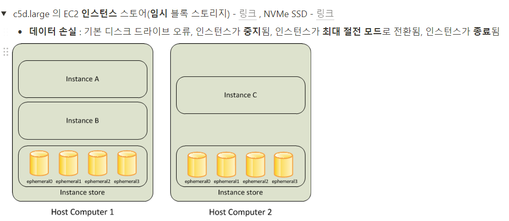


아래 명령어를 통해 인스토어 스토어 볼륨이 있는 c5모든 타입의 스토리지 크기를 조회하실 수 있습니다.
``` aws ec2 describe-instance-types \ --filters "Name=instance-type,Values=c5*" "Name=instance-storage-supported,Values=true" \ --query "InstanceTypes[].[InstanceType, InstanceStorageInfo.TotalSizeInGB]" \ --output table```

저희가 배포한 c5d.large는 50Gib 만큼의 크기를 제공하고 있습니다.

먼저 각 워커노드의 스토리지를 확인해 보도록 하겠습니다.
``` ssh -i ~/.ssh/id_rsa ubuntu@$W1PIP sudo apt install -y nvme-cli ```\n
``` ssh -i ~/.ssh/id_rsa ubuntu@$W2PIP sudo apt install -y nvme-cli ```\n
``` ssh -i ~/.ssh/id_rsa ubuntu@$W1PIP sudo nvme list ```\n
``` ssh -i ~/.ssh/id_rsa ubuntu@$W2PIP sudo nvme list ```\n

nvm list를 통해서 보면 2개의 스토리지를 확인하실 수 있습니다.

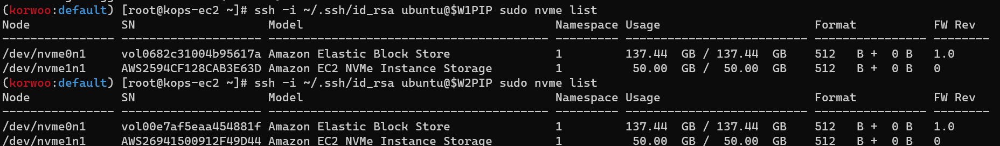

하지만 AWS Management Console를 통해서 보면 EC2에 할당된 디스크중에 50Gib짜리 디스크는 찾아보실 수 없습니다.

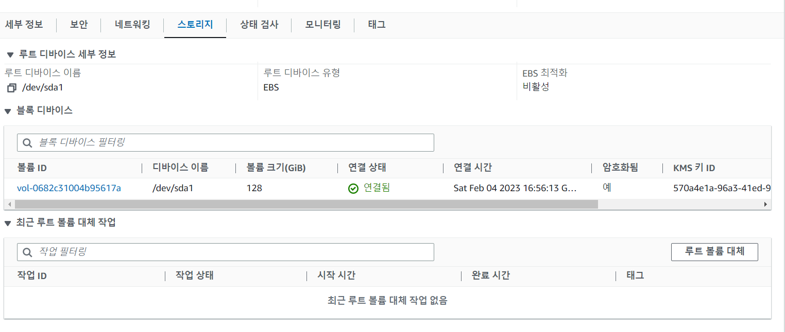

인스턴스 스토어에 대한 정보는 스토리지 정보에 출력이 되지 않는다는 점을 확인하실 수 있습니다.

아래의 명령어를 통해 파일시스템 생성 및 /data를 마운트 시킬 수 있습니다.
``` ssh -i ~/.ssh/id_rsa ubuntu@$W1PIP sudo mkfs -t xfs /dev/nvme1n1 ```\n
``` ssh -i ~/.ssh/id_rsa ubuntu@$W2PIP sudo mkfs -t xfs /dev/nvme1n1 ```\n
``` ssh -i ~/.ssh/id_rsa ubuntu@$W1PIP sudo mkdir /data ```\n
``` ssh -i ~/.ssh/id_rsa ubuntu@$W2PIP sudo mkdir /data ```\n
``` ssh -i ~/.ssh/id_rsa ubuntu@$W1PIP sudo mount /dev/nvme1n1 /data ```\n
``` ssh -i ~/.ssh/id_rsa ubuntu@$W2PIP sudo mount /dev/nvme1n1 /data ```\n
``` ssh -i ~/.ssh/id_rsa ubuntu@$W1PIP df -hT -t ext4 -t xfs ```\n
``` ssh -i ~/.ssh/id_rsa ubuntu@$W2PIP df -hT -t ext4 -t xfs ```\n

## 2.Ingress

지난주에 진행했던 실습과 비슷한 실습입니다.
각 EC2에 LB생성 권한을 부여해 LB를 생성하고 여기에 배포를 하여 외부에 오픈해주는 작업을 진행해 보겠습니다.

각 컨트롤플레인, 워커노드에 LB 생성 권한을 부여하겠습니다.
``` aws iam attach-role-policy --policy-arn arn:aws:iam::$ACCOUNT_ID:policy/AWSLoadBalancerControllerIAMPolicy --role-name nodes.$KOPS_CLUSTER_NAME ```\n
``` aws iam attach-role-policy --policy-arn arn:aws:iam::$ACCOUNT_ID:policy/AWSLoadBalancerControllerIAMPolicy --role-name nodes.$KOPS_CLUSTER_NAME ```\n

아래 명령어를 통해 IAM 권한또한 부여하겠습니다.

``` aws iam attach-role-policy --policy-arn arn:aws:iam::$ACCOUNT_ID:policy/AllowExternalDNSUpdates --role-name masters.$KOPS_CLUSTER_NAME ```\n
``` aws iam attach-role-policy --policy-arn arn:aws:iam::$ACCOUNT_ID:policy/AllowExternalDNSUpdates --role-name nodes.$KOPS_CLUSTER_NAME ```\n

다음 kops cluster edit을 통해

spec.cerManager.enable:ture
spec.LoadBalancerController.enable:true
spec.externalDns.provider:external-dns
를 추가해준 후 업데이트를 진행해주도록 하겠습니다.

``` kops update cluster --yes && echo && sleep 3 && kops rolling-update cluster ```\n

실습을 진행하기 전 항상 IAM에 해당 권한이 정상적으로 부여가 되었는지 확인 후 진행하기를 권장드립니다.
권한이 부여되어있지 않다면 LB가 생성되지 않습니다..ㅜㅜ
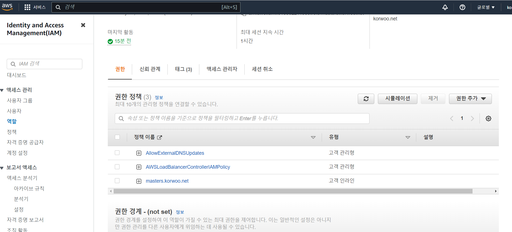

IAM 권한을 확인하였다면 POD를 배포해보도록 하겠습니다.
아래 명령어를 통해 POD를 배포해보도록 하겠습니다.

``` kubectl apply -f ~/pkos/3/ingress1.yaml ```\n

배포 후 AWS Management Console 에서 LB가 생성된것을 확인하실 수 있습니다.

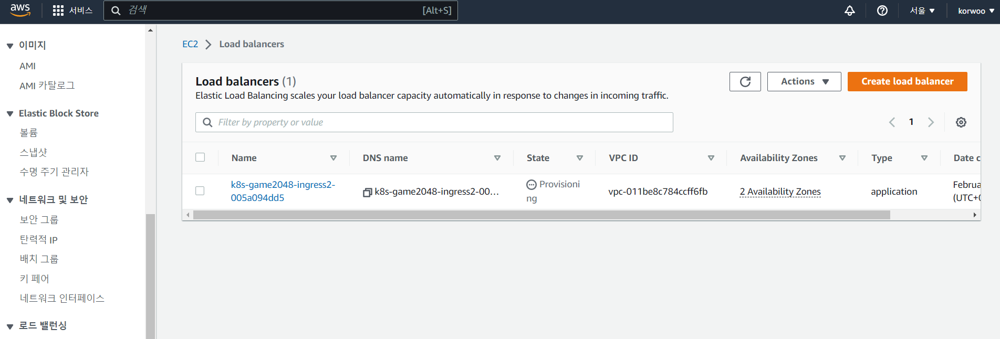

아래 명렁어를 통해 Ingress를 확인하실 수 있습니다.

``` kubectl describe ingress -n game-2048 ingress-2048 ```\n

아래 명렁어를 통해 외부에서 접속 가능한 게임의 URL 주소가 생성이 됩니다. 해당 URL에 접속해보도록 하겠습니다.

``` kubectl get ingress -n game-2048 ingress-2048 -o jsonpath={.status.loadBalancer.ingress[0].hostname} | awk '{ print "Game URL = http://"$1 }' ```\n

정상적으로 접속 됩니다!


명령어를 통해 POD의 IP를 조회해보겠습니다.
```  kubectl get pod -n game-2048 -owide ``` \n 

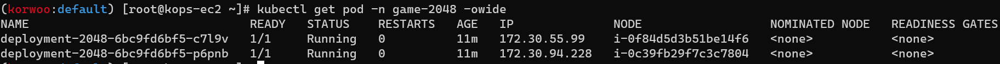


위의 POD의 IP가 LB의 백엔드풀에 정상적으로 등록된것을 확인하실 수 있습니다.

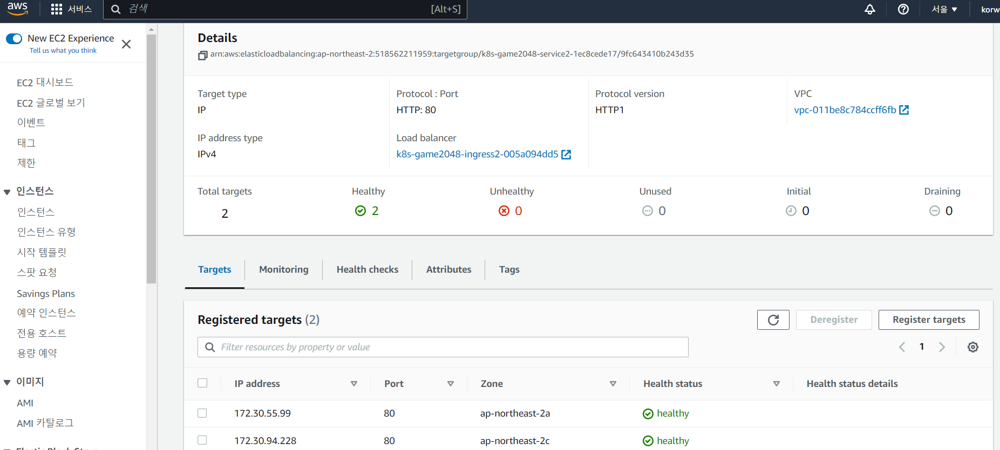

만약 해당 POD의 갯수를 늘려준다면 백엔드풀에 등록된 IP또한 계속해서 늘어나게 됩니다.

이후 아래 명령어를 통해 실습 리소스를 제거해주도록 합니다.

``` kubectl delete ingress ingress-2048 -n game-2048 ``` \n
``` kubectl delete svc service-2048 -n game-2048 && kubectl delete deploy deployment-2048 -n game-2048 && kubectl delete ns game-2048 ``` \n

다음 실습으로 넘어가겠습니다.

아래의 명렁어를 입력하여 본인이 지정한 도메인에 pod를 배포해보도록 하겠습니다.

``` WEBDOMAIN=albweb.korwoo.net ``` \n
``` WEBDOMAIN=$WEBDOMAIN envsubst < ~/pkos/3/ingress2.yaml | kubectl apply -f - ``` \n

AWS Management Console에서 본인이 지정한 도메인이 등록되어있는것을 확인하실 수 있습니다.


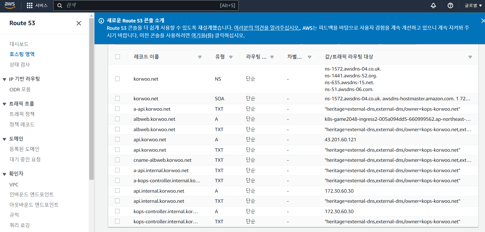

저는 제 모바일기기를 통하여 해당 도메인에 접속을하였고 접속이 성공적으로 되었습니다.


과제1. Ingress를 이용하여 /mario에는 mario 게임 접속, /tetris에는 tetris게임 접속되게 설정 및 SSL 적용 하기


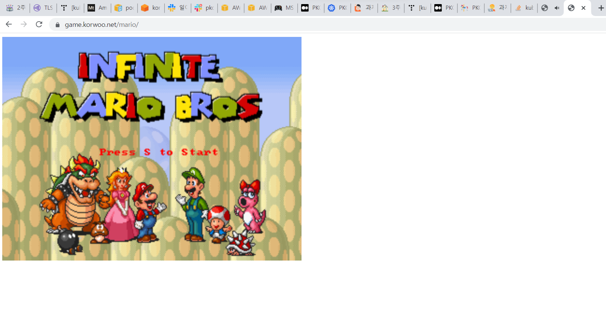
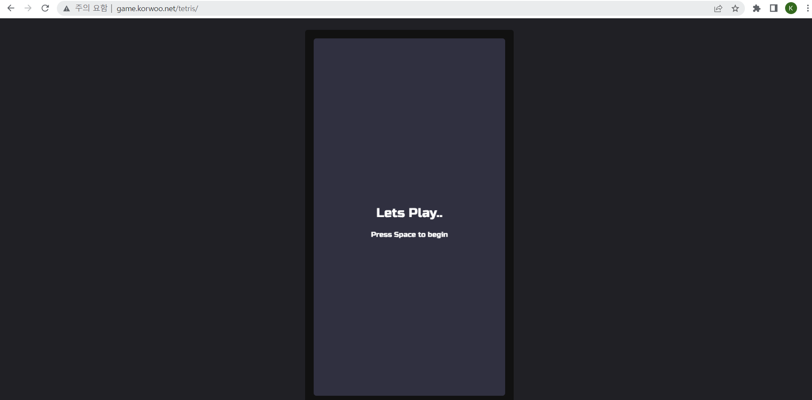


현재 화면에서 보시면 mario는 SSL이 적용되어 있으나, tetris는 SSL 이 적용되어 있지 않습니다..
현재 원인 분석 중 입니다..ㅜㅜ


## 3. K8S 스토리지

K8S 스토리지에서 가장 중요한 부분을 뽑자면 파드 내부의 데이터는 파드가 정지되면 모두 제거가 된다는 점 입니다.
따라서 보존이 필요한 중요한 데이터가 있다면 PV같은 Stateful 애플리케이션으로 데이터를 보존해야된다는 점을 기억해주시면 되겠습니다.

간단한 실습으로 데이터의 보존 여부를 체크해보겠습니다.
아래의 명령어를 통해 10초마다 1번씩 데이터를 기록하는 POD를 배포해보겠습니다.
``` kubectl apply -f ~/pkos/3/date-busybox-pod.yaml ``` \n

해당 POD를 배포하면 주기적으로 데이터를 기록하게 되는데
``` kubectl delete pod busybox ``` \n
``` kubectl apply -f ~/pkos/3/date-busybox-pod.yaml ``` \n

위의 명령어를 통해서 POD를 제거하였다가 다시 생성하였을 시 이전에 기록한 데이터가 남아있는지 확인합니다.

당연하게도 이전의 데이터는 모두 제거가 되게 됩니다.

과제2. HostPath 실습 및 문제점 확인과 성능 측정

먼저 HostPath를 사용하는 PV/PVC 스토리지 클래스를 배포하도록 하겠습니다!
local path 정의 파일 다운로드
``` curl -s -O https://raw.githubusercontent.com/rancher/local-path-provisioner/v0.0.23/deploy/local-path-storage.yaml ``` \n

vim local-path-storage.yaml 을 통해 각자 Control Plane의 이름 입력해줍니다.


아래 명령어를 입력해서 배포해보도록 하겠습니다.

``` kubectl apply -f local-path-storage.yaml ``` \n

다음으로 PV/PVC를 사용하는 POD를 생성해보도록 하겠습니다.

``` kubectl apply -f ~/pkos/3/localpath1.yaml ``` \n

``` kubectl get pvc ``` \n
``` kubectl describe pvc ``` \n
를 입력해서 PVC를 확인해보도록 하겠습니다.

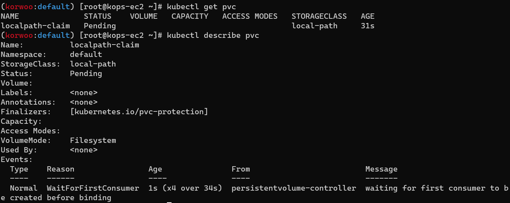

위에서 진행하였던 실습과 똑같이 10초마다 1번씩 데이터를 입력하는 POD를 배포해보도록 하겠습니다.

``` kubectl apply -f ~/pkos/3/localpath2.yaml ``` \n

각 워커노드에 Tool을 설치해주도록 하겠습니다.

``` ssh -i ~/.ssh/id_rsa ubuntu@$W1PIP sudo apt install -y tree jq sysstat ``` \n
``` ssh -i ~/.ssh/id_rsa ubuntu@$W2PIP sudo apt install -y tree jq sysstat ``` \n

배포된 POD에는 out.txt라는 파일이 있을것입니다. 아래 명령어로 확인 가능합니다.

``` ssh -i ~/.ssh/id_rsa ubuntu@$W1PIP tree /data ``` \n
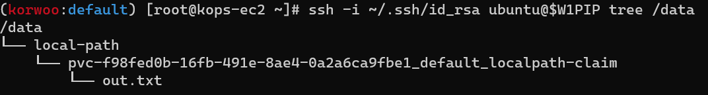

이 파일은 10초에 1번씩 입력되는 데이터를 저장하는 경로 입니다.
이제 POD를 제거하면 과연 데이터가 살아있을지 확인해보도록 하겠습니다.

``` kubectl delete pod app ``` \n
``` kubectl get pod,pv,pvc ``` \n

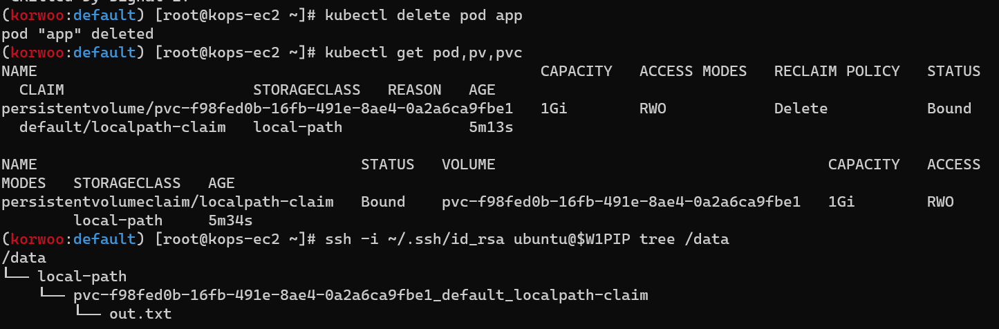

POD가 죽었음에도 PV가 살아있으니 데이터또한 같이 살아 있습니다!

다음으로 kubestr & sar을 활용하여 모니터링 및 성능측정 확인을 진행해보도록 하겠습니다.

아래 명령어로 kubestr를 다운로드 받아주도록 하겠습니다.

``` wget https://github.com/kastenhq/kubestr/releases/download/v0.4.36/kubestr_0.4.36_Linux_amd64.tar.gz ``` \n
``` tar xvfz kubestr_0.4.36_Linux_amd64.tar.gz && mv kubestr /usr/local/bin/ && chmod +x /usr/local/bin/kubestr ``` \n

아래 명령어로 모니터링을 걸어주도록 하겠습니다.

``` ssh -i ~/.ssh/id_rsa ubuntu@$W1PIP iostat -xmdz 1 -p nvme1n1 ``` \n
``` ssh -i ~/.ssh/id_rsa ubuntu@$W2PIP iostat -xmdz 1 -p nvme1n1 ``` \n

모니터링에서 표시되는 정보 관련 내용입니다.
rrqm/s : 초당 드라이버 요청 대기열에 들어가 병합된 읽기 요청 횟수
wrqm/s : 초당 드라이버 요청 대기열에 들어가 병합된 쓰기 요청 횟수
r/s : 초당 디스크 장치에 요청한 읽기 요청 횟수
w/s : 초당 디스크 장치에 요청한 쓰기 요청 횟수
rMB/s : 초당 디스크 장치에서 읽은 메가바이트 수
wMB/s : 초당 디스크 장치에 쓴 메가바이트 수
await : 가장 중요한 지표, 평균 응답 시간. 드라이버 요청 대기열에서 기다린 시간과 장치의 I/O 응답시간을 모두 포함 (단위: ms)

아래 명령어를 입력하여 측정을 시작하겠습니다.(5~10분정도 소요됩니다.)
```bash
curl -s -O https://raw.githubusercontent.com/wikibook/kubepractice/main/ch10/fio-read.fio
kubestr fio -f fio-read.fio -s local-path --size 10G
```


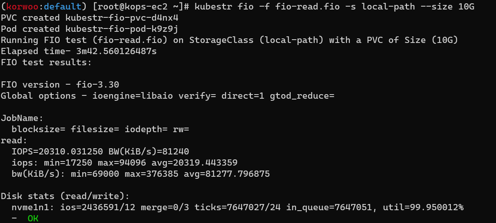


```bash
curl -s -O https://raw.githubusercontent.com/wikibook/kubepractice/main/ch10/fio-write.fio
kubestr fio -f fio-write.fio -s local-path --size 10G
```

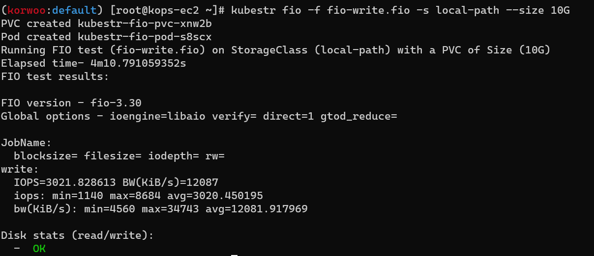


과제3. AWS EBS를 PVC로 사용 후 온라인 볼륨 증가 해보기

아래 명령어를 입력하여 aws-ebs-csi를 확인해봅니다. 미리 설치되어 있다고합니다.(친절한 가시다님ㅜㅜ)
```bash
kubectl get pod -n kube-system -l app.kubernetes.io/instance=aws-ebs-csi-driver
```

스토리지 클래스 확인

```bash
kubectl get sc kops-csi-1-21 kops-ssd-1-17
kubectl describe sc kops-csi-1-21 | grep Parameters
kubectl describe sc kops-ssd-1-17 | grep Parameters
```


아래 명령어를 입력해 워커노드의 EBS 볼륨을 확인해봅시다.
```bash
aws ec2 describe-volumes --filters Name=tag:k8s.io/role/node,Values=1 --output table
```

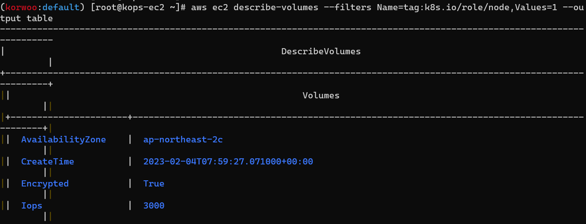

아래 명령어는 Pod에 추가한 EBS 볼륨을 확인하는 명령어 입니다.
```bash
aws ec2 describe-volumes --filters Name=tag:ebs.csi.aws.com/cluster,Values=true --output table
```


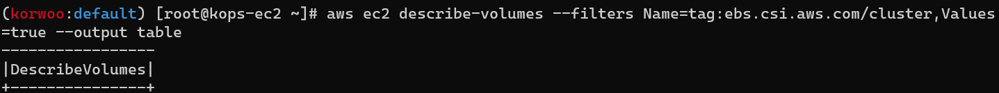

아래 명령어로 PVC,POD를 생성해주도록 하겠습니다.

```bash
kubectl apply -f ~/pkos/3/awsebs-pvc.yaml
kubectl apply -f ~/pkos/3/awsebs-pod.yaml
```


다음 아래 명령어를 통해 볼륨 정보를 확인하실 수 있습니다.
```bash
kubectl exec -it app -- sh -c 'df -hT --type=ext4'
```

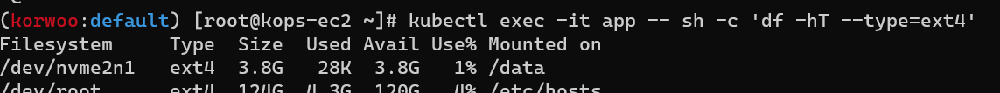

또한 AWS Management Console -> EC2 -> 볼륨으로 들어가면 4Gi의 볼륨이 생성된것을 확인하실 수 있습니다.

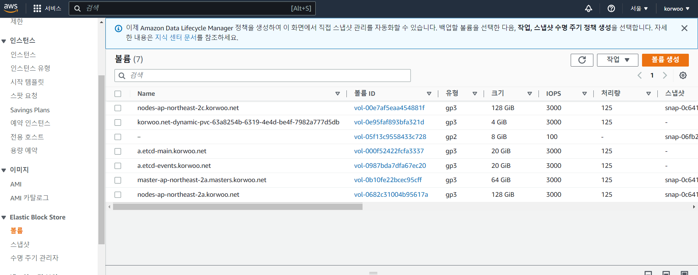

아래의 명령어를 통해 4Gi -> 10Gi 로 용량을 증가시켜 준다.
```bash
kubectl patch pvc ebs-claim -p '{"spec":{"resources":{"requests":{"storage":"10Gi"}}}}'
```

용량이 증가된것을 확인하실 수 있습니다.

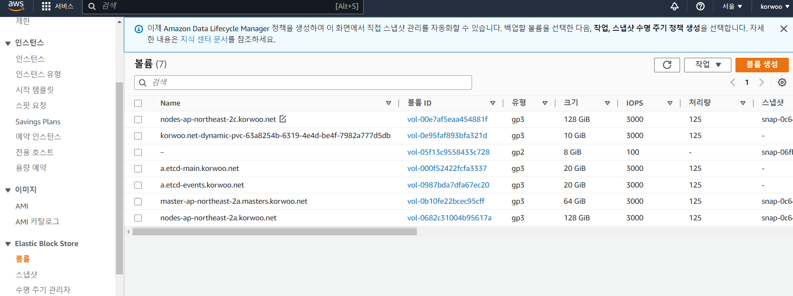

혹은 아래 명렁어를 통해서도 확인하실 수 있습니다!

```bash
kubectl exec -it app -- sh -c 'df -hT --type=ext4'
```


과제4. AWS Volume Snapshot 실습

kops edit 을 통해 아래 표시된 부분을 추가해준후 업데이트 해주도록 하겠습니다.

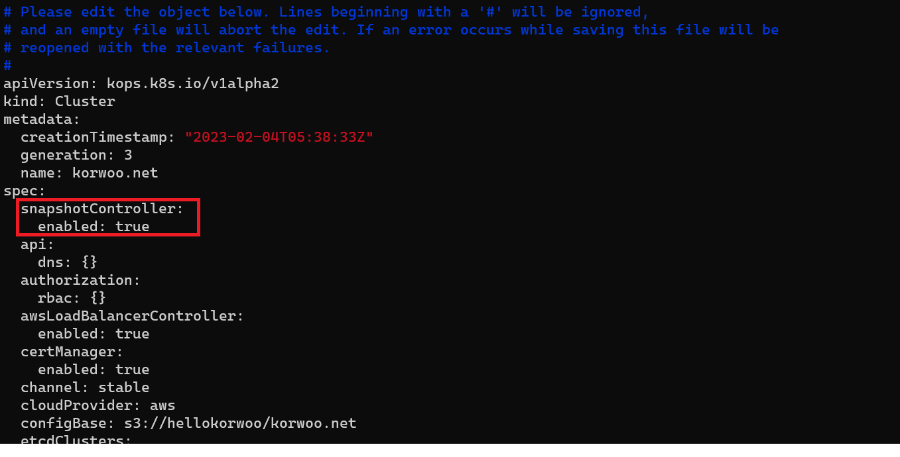

아래 명령어를 통해 업데이트가 되었는지 확인해보겠습니다.

```bash
kubectl get crd | grep volumesnapshot
```

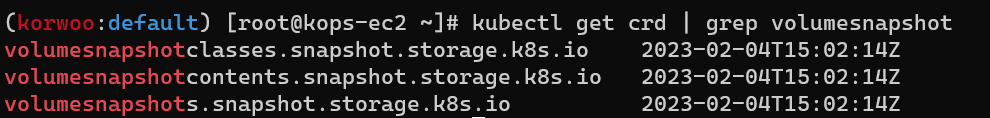

아래 명령어를 통해 vsclass 생성해주도록 하겠습니다.

```bash
kubectl apply -f https://raw.githubusercontent.com/kubernetes-sigs/aws-ebs-csi-driver/master/examples/kubernetes/snapshot/manifests/classes/snapshotclass.yaml
```

PVC, POD 생성 명령어
```bash
kubectl apply -f ~/pkos/3/awsebs-pvc.yaml
kubectl apply -f ~/pkos/3/awsebs-pod.yaml
```


아래 명령어를 통해 볼륨 스냅샷을 생성해주도록 하겠습니다.
```bash
kubectl apply -f ~/pkos/3/ebs-volume-snapshot.yaml
```


볼륨 스냅샷을 확인하는 명령어 입니다.
```bash
kubectl get volumesnapshot
```


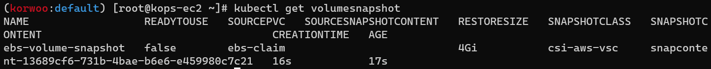

완료가 되었다면 복원을 해보겠습니다.
임의로 app & pvc를 제거하여 이슈를 만들어보겠습니다.
```bash
kubectl delete pod app && kubectl delete pvc ebs-claim
```


이후 스냅샷에서 PVC로 복원을 해보겠습니다.

```bash
kubectl apply -f ~/pkos/3/ebs-snapshot-restored-claim.yaml
kubectl apply -f ~/pkos/3/ebs-snapshot-restored-pod.yaml
```


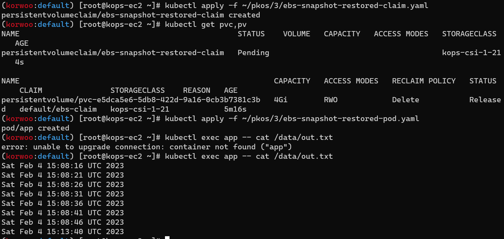

완료되어 이전에 입력되었던 데이터가 그대로 살아있는것을 확인하실 수 있습니다.


```toc

```


```toc

```
