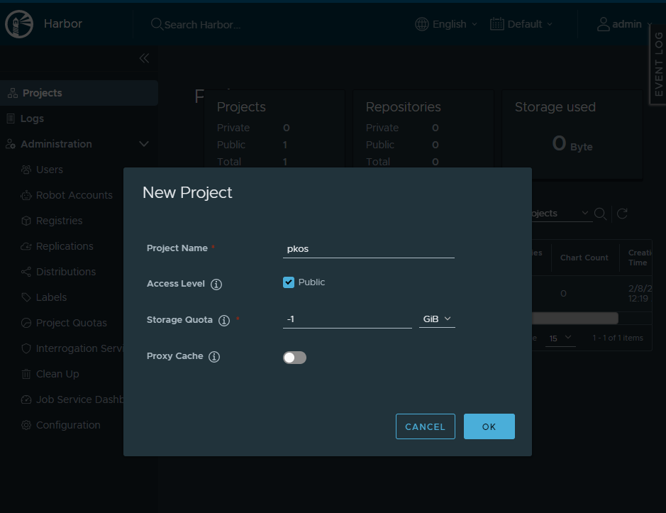
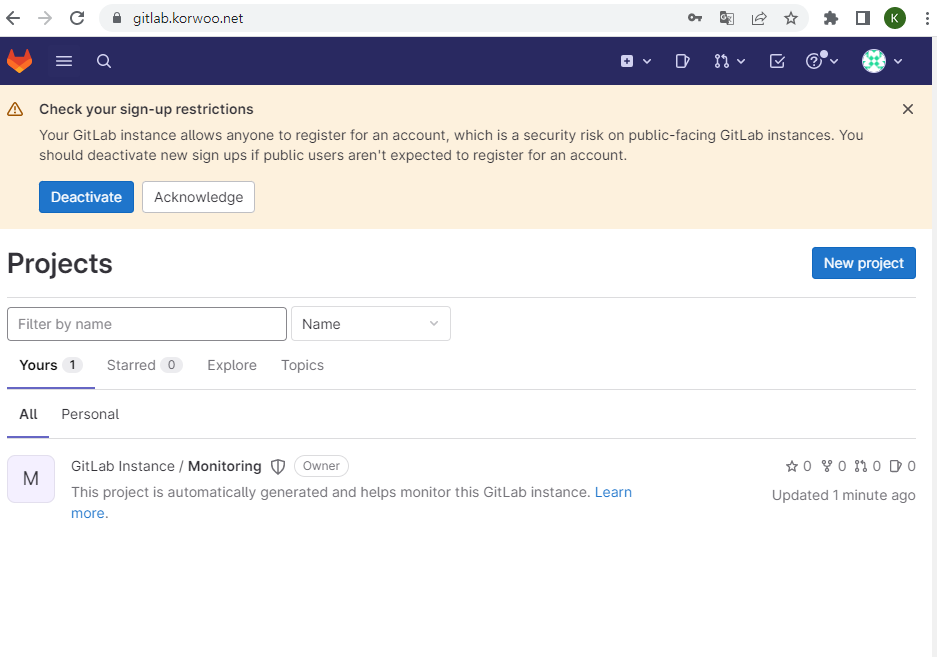
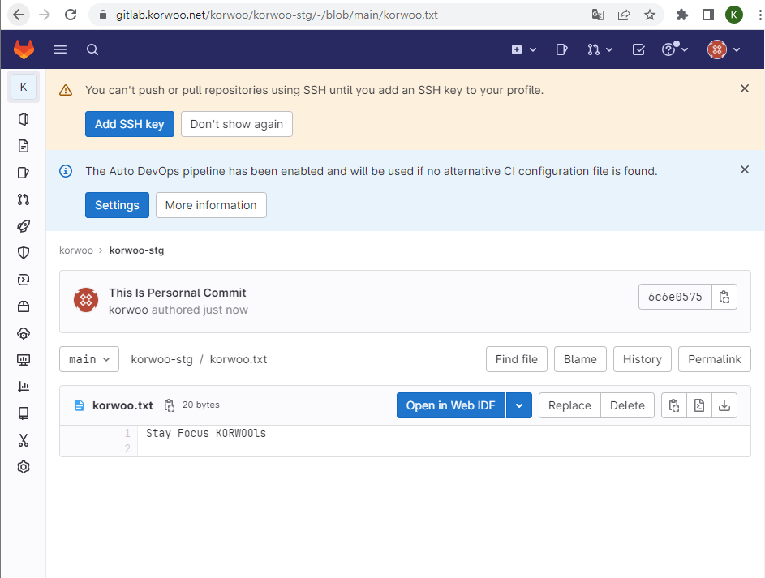

가시다님 스터디 : https://www.notion.so/gasidaseo/23-7635cc4f02c04954a3260b317588113e

4주차 Harbor를 이용한 이미지 저장소 구축 및 ArgoCD

## 1.ArgoCD??

어느덧 가시다님의 쿠버네티스 스터디도 4주차에 접어들었습니다.
이번주의 주제는 Harbor 구축 및 ArgoCD 입니다.
Harbor의 경우 제가 근무하고 있는 회사에서 한때 사용하였던 경험이 있어 나름 익숙한 Container Registry 였지만
ArgoCD같은 경우 여기저기서 많이 들어는봤지만 생소한 개념이었습니다..ㅜㅜ
그래서 ArgoCD가 무엇인지에 대해 설명하고 넘어가겠습니다.

ArgoCD에 대해 설명하기 위해서는 먼저 GitOps에 대해 알아야합니다.
GitOps는 어렵게 생각할것 없이 Git에서 사용하는 Devops의 실천 방법 중 하나입니다.
그중에서도 CD(Continous Deployment)에 초점을 두고 있습니다.

GitOps의 핵심 아이디어는
1. 배포에 관련된 모든 것을 선언형 기술서(Declarative Descriptions)형태로 작성하여 Config Repostiry에서 관리
2. Config Repositry의 선언형 기술서와 운영 환경 간 상태차이가 없도록 유지시키는 자동화 시스템 구성

즉 GitOps는 K8S Manifest 파일을 Git에서 관리하고 배포할때에도 Git에 저장된 Manifest로 Cluster에 배포하는 과정입니다.
Manifest 파일에 배포된 상태가 어떤 모양을 가져아 할지 선언되어 있는 방식으로 정의하여 단일 진실의 원천(SSOT) 를 지킵니다.
GitOps를 사용하면 배포상태의 모습을 항상 Manifest에 정의된 대로 원천가 동일하게 맞추며 현재 배포환경의 상태를 쉽게 파악할 수 있습니다.

GitOps에 대해서 설명드릴 내용이 좀 더 많이 있으나 GitOps가 메인이 아닌지라 기회가 된다면 다음 포스팅에서 GitOps에 대해 다뤄볼수 있도록 하겠습니다.
이 GitOps를 구현체가 바로 ArgoCD 입니다!!

서론이 길었습니다.

바로 실습으로 넘어가도록 하겠습니다.


## 2. Harbor Container Registry 구축
Cluster 구성 과정은 지난번 포스팅을 참고하여 주시고 바로 진행하겠습니다.

먼저 지나번과 같이 Control Plane, Worker Node에 AWS LoadBalancer, ExternalDNS 에 대한 권한을 부여하겠습니다.


```bash
aws iam attach-role-policy --policy-arn arn:aws:iam::$ACCOUNT_ID:policy/AWSLoadBalancerControllerIAMPolicy --role-name masters.$KOPS_CLUSTER_NAME
aws iam attach-role-policy --policy-arn arn:aws:iam::$ACCOUNT_ID:policy/AWSLoadBalancerControllerIAMPolicy --role-name nodes.$KOPS_CLUSTER_NAME
aws iam attach-role-policy --policy-arn arn:aws:iam::$ACCOUNT_ID:policy/AllowExternalDNSUpdates --role-name masters.$KOPS_CLUSTER_NAME
aws iam attach-role-policy --policy-arn arn:aws:iam::$ACCOUNT_ID:policy/AllowExternalDNSUpdates --role-name nodes.$KOPS_CLUSTER_NAME
```
다음 kops cluster 를 업데이트 해주도록하겠습니다.
```bash
kops edit cluster
-----
spec:
  certManager:
    enabled: true
  awsLoadBalancerController:
    enabled: true
  externalDns:
    provider: external-dns
-----

kops update cluster --yes && echo && sleep 3 && kops rolling-update cluster
```

다음은 이미지 저장소인 Harbor를 설치해주도록 하겠습니다.
Harbor 설치는 Helm Chart를 통해 설치를 진행하도록하겠습니다.

```bash
helm repo add harbor https://helm.goharbor.io
helm fetch harbor/harbor --untar
```

다음 value.yaml에 대한 수정이 필요합니다.
```bash
vim ~/harbor/values.yaml

expose.tls.certSource=none  # 19줄
expose.ingress.hosts.core=harbor.<각자자신의도메인>    # 36줄
expose.ingress.hosts.notary=notary.<각자자신의도메인>  # 37줄
expose.ingress.hosts.core=harbor.korwoo.link    
expose.ingress.hosts.notary=notary.korwoo.link  
expose.ingress.controller=alb                      # 44줄
expose.ingress.className=alb                       # 47줄
expose.ingress.annotations=alb.ingress.kubernetes.io/scheme: internet-facing
expose.ingress.annotations=alb.ingress.kubernetes.io/target-type: ip
expose.ingress.annotations=alb.ingress.kubernetes.io/listen-ports: '[{"HTTPS":443}, {"HTTP":80}]'
expose.ingress.annotations=alb.ingress.kubernetes.io/certificate-arn: ${CERT_ARN}
externalURL=https://harbor.<각자자신의도메인>
externalURL=https://harbor.korwoo.link             # 131줄
```
위의 yaml 파일 내용수정 중 
51~54번째줄에 해당하는 내용은 주석처리를 해주시면 됩니다.
추가적으로 expore.ingress.annotations=alb.ingress.kubernetes.io/certificate-arn: ${CERT_ARN} 부분은
문자 그대로 넣어주시는것이 아니라
터미널에서 echo "alb.ingress.kubernetes.io/certificate-arn: $CERT_ARN" 명령어를 입력하여 나온 값을
${CERT_ARN} 값 대신에 넣어줄수 있도록 합니다.
단순히 ${CERN_ARN} 값을 넣으면 인증키 값이 꼬일수도 있기 떄문입니다.


수정이 완료 되었다면
아래의 명령어를 입력하여 helm install을 진행해주도록 하겠습니다.

```bash
kubectl create ns harbor
helm install harbor harbor/harbor -f ~/harbor/values.yaml --namespace harbor --version 1.11.0
```
헬름 인스톨 이후 
harbor.자신의도메인 에 접속하시면 Harbor에 접속하실 수 있습니다.
이 작업또한 시간이 조금 필요하기에 느긋하게 5분정도 후에 접속해보시면 되겠습니다!


만약 접속이 잘 안되실 경우 IAM에서 역할 할당이 잘 되어있는지,
Route53에 harbor.도메인이 잘 등록되어 있는지,
LB는 잘 생성되어 있는지를 확인해주시면 되겠습니다.

정상적으로 접속이 되었습니다.


ID PW 는 기본
ID : admin
PW : Harbor12345로 설정이 되어있습니다.

접속이 되었다면 신규 프로젝트를 생성해주도록하겠습니다.



이미지 레지스트리가 잘 생성 되었으므로 한번 이미지저장소에 이미지를 Push해보도록 하겠습니다.
아래 명령어를 통해 임의의 이미지를 내려받고 태그를 달아주도록 하겠습니다.
```bash
docker pull nginx
docker pull busybox
docker tag busybox harbor.$KOPS_CLUSTER_NAME/pkos/busybox:0.1
```

아래 명령어는 insecure 설정 명령어입니다. 진행해주도록 하겠습니다. 진행 후 daemor reload 및 docker 재시작을 하겠습니다.
```bash
cat <<EOT> /etc/docker/daemon.json
{
    "insecure-registries" : ["harbor.$KOPS_CLUSTER_NAME"]
}
EOT

systemctl daemon-reload && systemctl restart docker
```

다음 아래 명령어를 통하여 Harbor에 로그인하고 이미지를 Push하겠습니다.
```bash
docker login harbor.$KOPS_CLUSTER_NAME -u admin -p Harbor12345
docker push harbor.$KOPS_CLUSTER_NAME/pkos/busybox:0.1
```

명령어 수행 후 Harbor에서 Image가 정상적으로 Push 된것을 확인하실 수 있습니다.


다음은 YAML 파일의 컨테이너 이미지 저장소 주소를 Local Harbor로 변경해보겠습니다.

```bash
curl -s -O https://raw.githubusercontent.com/junghoon2/kube-books/main/ch13/busybox-deploy.yml
sed -i "s|harbor.myweb.io/erp|harbor.$KOPS_CLUSTER_NAME/pkos|g" busybox-deploy.yml
```

위의 명령어의 yaml 파일을 조회하시면 image가 저희가 방금 저장하였던 local Harbor의 이미지로 지정이 되어있습니다.
kubectl apply -f busybox-deply.yml 을 입력하시면
해당 이미지가 Pulling 되어 Pod가 기동될것입니다.

## 3. GitLab 을 이용한 Local Git 소스 저장소 구축

Gitops 실습에 앞서 소스 저장소 구축을 위해 GitLab 이용해 Local Git 저장소를 구축해보겠습니다.
참고로 GitLab은 최소 요구사항이 제법 높은편입니다.(https://docs.gitlab.com/ee/install/requirements.html)
그래서 실습할때 높은 사양의 EC2를 생성해주는것을 권장드립니다.
아래의 명령어를 순차적으로 입력해주겠습니다.
```bash
kubectl create ns gitlab
helm repo add gitlab https://charts.gitlab.io/
helm repo update
helm fetch gitlab/gitlab --untar
```


다음 yaml 파일을 아래와 같이 수정해주시면 되겠습니다.
```bash
vim ~/gitlab/values.yaml
----------------------
global:
  hosts:
    domain: <각자자신의도메인>             # 52줄
    https: true

  ingress:                  # 66줄
    configureCertmanager: false
    provider: aws
    class: alb
    annotations:
      alb.ingress.kubernetes.io/scheme: internet-facing
      alb.ingress.kubernetes.io/target-type: ip
      alb.ingress.kubernetes.io/listen-ports: '[{"HTTPS":443}, {"HTTP":80}]'
      alb.ingress.kubernetes.io/certificate-arn: ${CERT_ARN}
      alb.ingress.kubernetes.io/success-codes: 200-399
    tls:
      enabled: false

certmanager:           # 834줄
  installCRDs: false
  install: false
  rbac:
    create: false

nginx-ingress:
  enabled: false

prometheus:    #904줄
  install: false

gitlab-runner:       #1129줄
  install: false
----------------------

helm install gitlab gitlab/gitlab -f ~/gitlab/values.yaml --namespace gitlab --version 6.8.1
```

수정 참고용 이미지 첨부하겠습니다.


헬름 인스톨이 완료되었다면 아래 명령어를 통해 Gitlab 접속 비밀번호를 출력하실 수 있습니다.
```bash
kubectl get secrets -n gitlab gitlab-gitlab-initial-root-password --template={{.data.password}} | base64 -d ;echo
```

다음 gitlab.자신의 도메인으로 접속하시고
ID : root
PW : 위의 명령어의 출력값
을 입력하셔서 접속테스트를 해보시면 되겠습니다.



Gitlab에 접속하신 후 신규 유저를 생성하겠습니다.
권한은 Admin으로 설정해주시면 되겠습니다.

계정 생성 후 상단의 Edit 버튼을 눌러 비밀번호를 설정 해주도록 합니다.


비밀번호 설정후 Impersonation Token 을 클릭하고 표시된 모든 scopes를 선택하여 Token을 생성해주도록 하겠습니다.


계정 생성 및 토큰 발급이 끝났다면 기존에 로그인 되어있던 root 계정을 로그아웃 하고 생성한 계정으로 로그인 해주도록하겠습니다.
로그인 후 blank project를 신규 생성해주도록 하겠습니다.


프로젝트 생성이 되었다면 쿠버네티스에서 사용하는 YAML 파일을 GitLab에 업로드 해보도록 하겠습니다.
아래의 명령어를 차근차근 입력해주시면 되겠습니다.
이떄 git clone 이후 Password 입력 부분은 붙여넣기 해도 입력이 안된것처럼 보이는데 정상적인 현상이므로 붙여넣기 해주시면 되겠습니다.

```bash
mkdir ~/gitlab-test && cd ~/gitlab-test
# git 계정 초기화 : 토큰 및 로그인 실패 시 매번 실행해주자
git config --system --unset credential.helper
git config --global --unset credential.helper

# git 계정 정보 확인 및 global 계정 정보 입력
git config --list
git config --global user.name "<각자 자신의 Gitlab 계정>"
git config --global user.email "<각자 자신의 Gitlab 계정의 이메일>"

# git clone
git clone https://gitlab.$KOPS_CLUSTER_NAME/<각자 자신의 Gialba 계정>/test-stg.git
git clone https://gitlab.$KOPS_CLUSTER_NAME/korwoo/test-stg.git
Cloning into 'test-stg'...
Username for 'https://gitlab.korwoo.net': korwoo
Password for 'https://korwoo@gitlab.korwoo.net': <토큰 입력>

# 이동
ls -al test-stg && cd test-stg

# 파일 생성 및 깃 업로드(push) : 웹에서 확인
echo "gitlab test memo" >> test.txt
git add . && git commit -m "initial commit - add test.txt"
```


정상적으로 업로드 되었습니다!!


## 4. ArgoCD 구축

모든 준비가 완료되었습니다. 이제 ArgoCD를 설치해보도록 하겠습니다.
```bash
cd
helm repo add argo https://argoproj.github.io/argo-helm
helm repo update
helm install argocd argo/argo-cd --set server.service.type=LoadBalancer --namespace argocd --version 5.19.14

# admin 계정의 암호 확인
ARGOPW=$(kubectl -n argocd get secret argocd-initial-admin-secret -o jsonpath="{.data.password}" | base64 -d)
echo $ARGOPW

```

설치가 완료되었다면 AWS Management Console에 접속하셔서 LB에 접속하시고 ArgoCD의 LB에 해당하는 DNS name으로 접속해봅시다.
ID : root
PW : 위에서 출력한 $ARGOPW


정상적으로 접속 가능합니다!!


이제 ArgoCD로 애플리케이션 배포에 사용할 깃 저장소와 쿠버네티스 클러스터 정보 등록을 위하여 ArgoCD CLI 도구를 설치해보겠습니다.

```bash
curl -sSL -o argocd-linux-amd64 https://github.com/argoproj/argo-cd/releases/latest/download/argocd-linux-amd64
install -m 555 argocd-linux-amd64 /usr/local/bin/argocd
chmod +x /usr/local/bin/argocd


# 버전 확인
argocd version --short
```

CLI를 설치했으면 ArgoCD에 로그인 해보겠습니다.
```bash
CLB=<각자 자신의 argocd 서비스의 CLB 도메인 주소>

# argocd 서버 로그인
argocd login $CLB --username admin --password $ARGOPW
# 기 설치한 깃랩의 프로젝트 URL 을 argocd 깃 리포지토리(argocd repo)로 등록. 깃랩은 프로젝트 단위로 소스 코드를 보관.
argocd repo add https://gitlab.$KOPS_CLUSTER_NAME/korwoo/test-stg.git --username korwoo --password hello1234
 
# 등록 확인 : 기본적으로 아르고시디가 설치된 쿠버네티스 클러스터는 타깃 클러스터로 등록됨
argocd repo list

# 기본적으로 아르고시디가 설치된 쿠버네티스 클러스터는 타깃 클러스터로 등록됨
argocd cluster list
```


로그인이 완료되었다면 ArgoCD를 이용해서 RabbiMQ Helm 애플리케이션을 배포해보도록 하겠습니다.

```bash
# RabbitMQ 헬름 차트 설치
helm repo add bitnami https://charts.bitnami.com/bitnami
helm repo update
helm fetch bitnami/rabbitmq --untar
cd rabbitmq/
cp values.yaml my-values.yaml

# 헬름 차트를 깃랩 저장소에 업로드
git add . && git commit -m "add rabbitmq helm"
git push
```

다음으로 ArgoCD에서 직접 동작하는것 확인하기 위한 작업을 진행해보도록 하겠습니다.

```bash
cd ~/
curl -s -O https://raw.githubusercontent.com/wikibook/kubepractice/main/ch15/rabbitmq-helm-argo-application.yml
vim rabbitmq-helm-argo-application.yml

--------------------------------------
apiVersion: argoproj.io/v1alpha1
kind: Application
metadata:
  name: rabbitmq-helm
  namespace: argocd
  finalizers:
  - resources-finalizer.argocd.argoproj.io
spec:
  destination:
    namespace: rabbitmq
    server: https://kubernetes.default.svc
  project: default
  source:
    repoURL: https://gitlab.korwoo.net/korwoo/test-stg.git
    path: rabbitmq
    targetRevision: HEAD
    helm:
      valueFiles:
      - my-values.yaml
  syncPolicy:
    syncOptions:
    - CreateNamespace=true
--------------------------------------

kubectl apply -f rabbitmq-helm-argo-application.yml


```
정상 작동하는것을 확인하실 수 있습니다.


## 5.과제 1.  Harbor에 자신만의 아무 이미지나 태그해서 업로드하고 다운로드해서 스크린샷

저는 Azure에 이미지 저장소를 하나 만들어서 컨테이너를 하나 Push해둔 상태입니다.
Azure Container Registry에 저장되어 있는 이미지를 Harbor에 Push & Pull 해보겠습니다.


아래의 명령어를 입력하여 Azrue CLI를 설치하고 Azure에 로그인을 해보겠습니다.
```bash
curl -L https://aka.ms/InstallAzureCli | bash

설치완료 후
az login
az acr login -n <컨테이너 저장소 이름>
az acr loign -n korwoo
docker pull korwoo.azurecr.io/korwoo_project:47
docker tag 이미지id harbor.$KOPS_CLUSTER_NAME/pkos/stayfocus:0.1
docker login harbor.$KOPS_CLUSTER_NAME -u admin -p Harbor12345
docker push harbor.$KOPS_CLUSTER_NAME/pkos/stayfocus:0.1

```


이미지가 정상적으로 Push 되었습니다.
이제 해당 이미지를 Pull 해보도록 하겠습니다.
```bash
docker rmi -f <이미지id> 
docker pull harbor.korwoo.net/pkos/stayfocus:0.1
```


## 6.과제 2.   자신만의 텍스트 파일을 kops-ec2 로컬에서 GitLab에 올려보기

```bash
mkdir korwoo-gitlab && cd korwoo-gitlab

git config --list

git config 설정이 제대로 안되어 있다면
git config --global user.name "korwoo"
git config --global user.email "korwoo93@gmail.com"

```
이후 위의 과정을 참고하여 다시 신규 프로젝트를 생성해주자
```bash
git clone https://gitlab.korwoo.net/korwoo/korwoo-stg.git
cd korwoo-stg
echo "stay focus korwoo!!" >> korwoo.txt
git add . && git commit -m "This Is Persornal Commit"
git push

```



## 7 과제3 . 교제의 책 273P GitOPS 실습 해보기(클러스터 설정 내역 변경과 깃 저장소 자동 반영)

클러스터 설정 변경 검증을 위한 2개의 애플리케이션 배포를 위한 yml파일을 준비해주겠습니다.

```bash
httpd-deploy.yml

apiVersion: apps/v1
kind: Deployment
metadata:
  name: httpd
  namespace: httpd
  labels:
    app: httpd  #service가 바라보는 label이 아님. 주의.
spec:
  replicas: 3
  selector:
    matchLabels:
      app: httpd  
  template:
    metadata:
      labels:
        app: httpd  # Service가 바라보는 label 지정 
    spec:
      containers:
      - name: httpd
        image: httpd
```
```bash
httpd-svc.yml

apiVersion: v1
kind: Service
metadata:
  name: httpd-svc
  namespace: httpd
spec:
  ports:
  - name: http
    port: 80
    protocol: TCP
    targetPort: 80
    nodePort: 30180
  selector:
    app: httpd
  type: NodePort
```

```bash
cd ~/gitlab-test/test-stg/
mkdir 03.httpd
cd 03.httpd
```

이후 03.httpd 디렉터리에 위2개의 yaml 파일을 저장후 Push 시켜줍니다.


아래의 yaml파일은 아파치 웹서버를 설치하는 ArgoCD application CRD yaml 파일 입니다.
```bash
httpd-directory-argo-application.yml

apiVersion: argoproj.io/v1alpha1
kind: Application
metadata:
  name: httpd
  namespace: argocd  
  finalizers:
  - resources-finalizer.argocd.argoproj.io
spec:
  destination:
    namespace: httpd
    server: https://kubernetes.default.svc
  project: default
  source:
    repoURL: https://gitlab.korwoo.net/korwoo/test-stg.git
    path: 03.httpd
    targetRevision: HEAD
    directory:
      recurse: true
  syncPolicy:
    syncOptions:
    - CreateNamespace=true
    automated:
      prune: true
      
kubectl apply -f httpd-directory-argo-application.yml
```

이후
k get applications -n argocd 명령어를 통해 httpd가 Healthy 상태로 바뀐것을 확인할 수 있습니다.
yaml 파일 마지막 부분에 automated.prune: true이 설정하여 ArgoCD 에서 SYNC 하지 않아도 자동을 동기화 작업을 진행하게 됩니다.
동기화 작업이 완료되어있다면 POD와 Object를 정상적으로 조회할 수 있습니다.

설치가 정상적으로 되었습니다!!


이제 깃 저장소에서 소스변경 하지 않고 클러스터에서 임의로 리소스를 변경하고 오브젝트를 삭제하여 ARgoCD GitOps의 동작 과정을 확인해보도록 하겠습니다.

```bash
k ns httpd
k edit deployments.apps httpd

containers.image: httpd:alpine

```
ArgoCD 페이지에서 APPDIFF 메뉴를 통해 차이점을 확인하실 수 있습니다.


그렇다면 이번에는 오브젝트를 삭제해보도록 하겠습니다.
```bash
k get svc
k delete svc httpd-svc
```

ArgoCD 페이지에서 변경 내역을 확인하실 수 있습니다.


위의 화면에서 보시면 APP Health 가 Missiong 상태임을 확인하실 수 있습니다.

k get applications -n argocd 명령어로도 확인이 가능합니다.


여기서 위의 메뉴중에 SYNC 라는 메뉴가 있는데 이 메뉴를 클릭하면 깃 저장소에 애플리케이션 상태를 일치화 시킬 수 있습니다.

SYNC를 시켜보니 깃 저장소와 애플리케이션 상태가 일치된거 같습니다! 명령어를 통해서도 확인해보겠습니다.


```bash
k get svc
k describe pod httpd-676d9bc46d-94d2z
```


```toc

```


```toc

```
