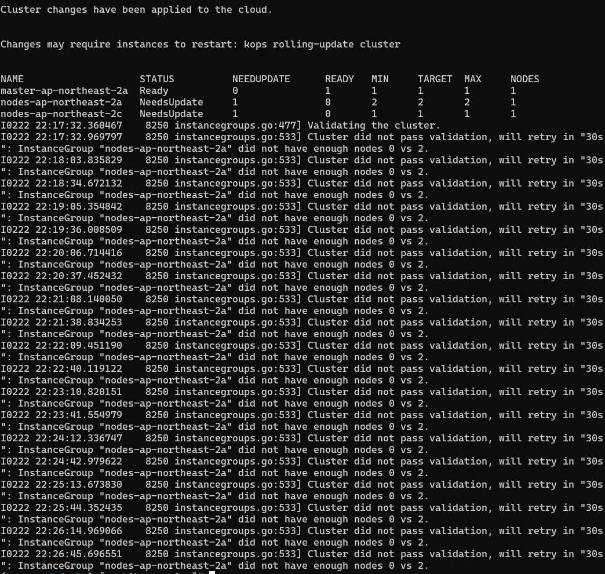
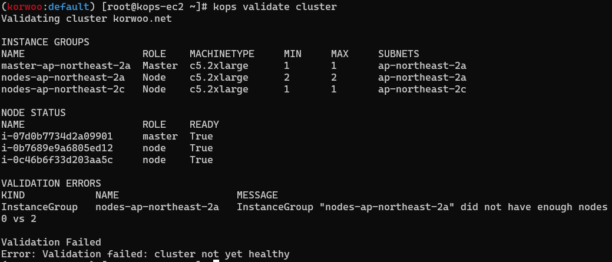
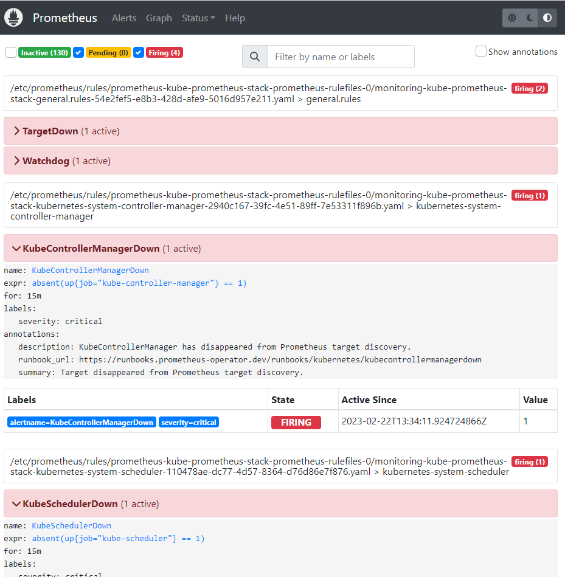
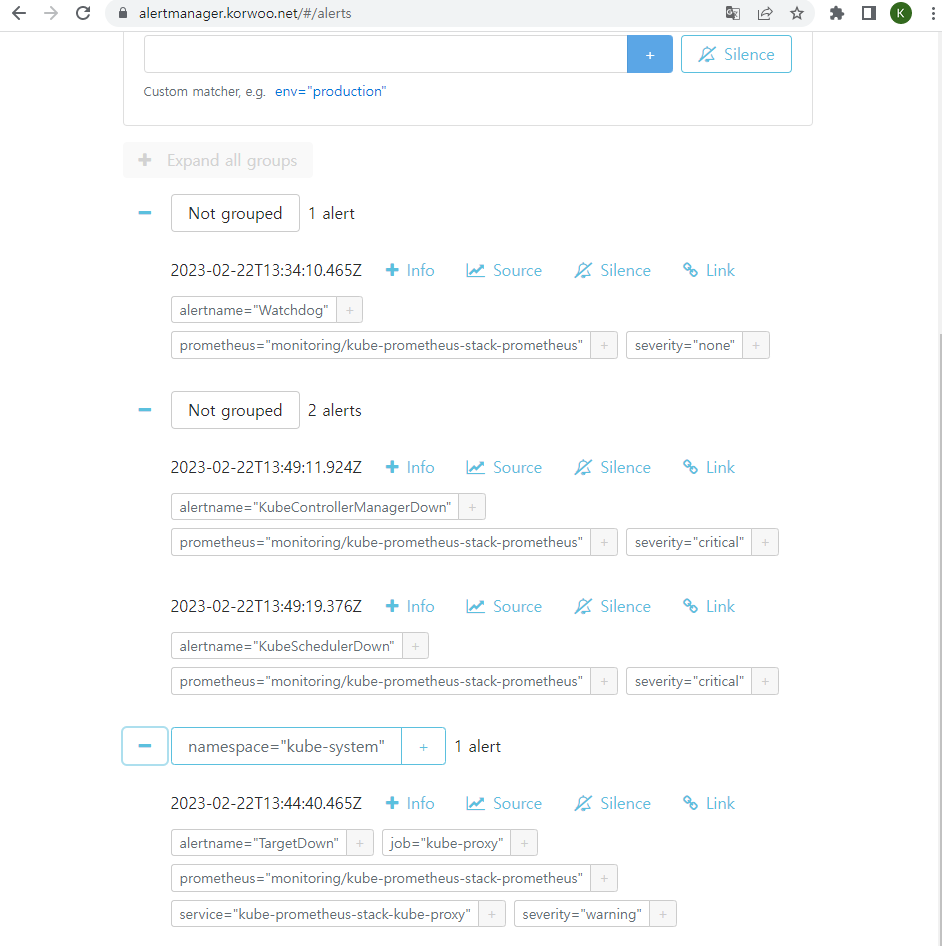
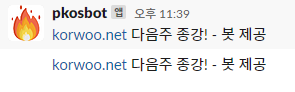
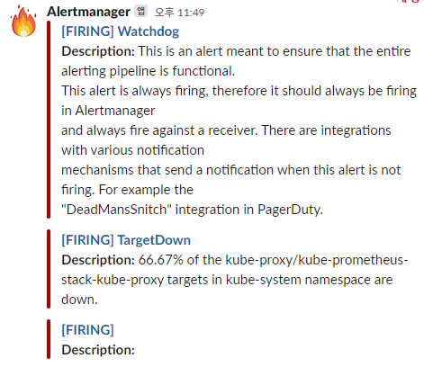
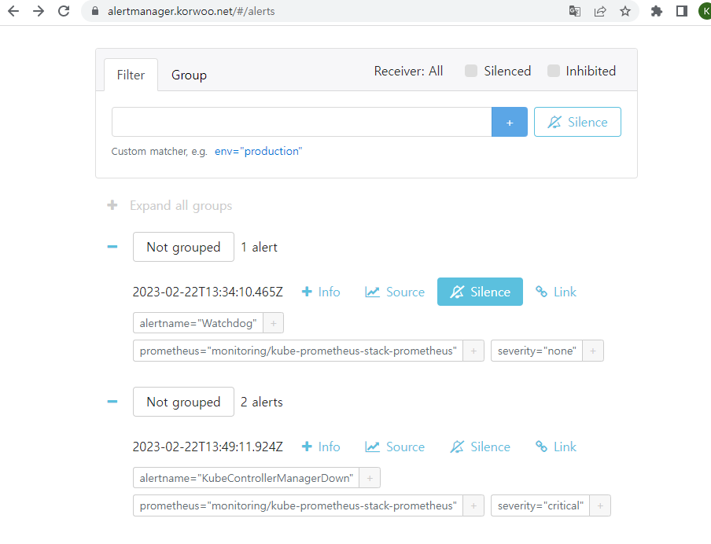
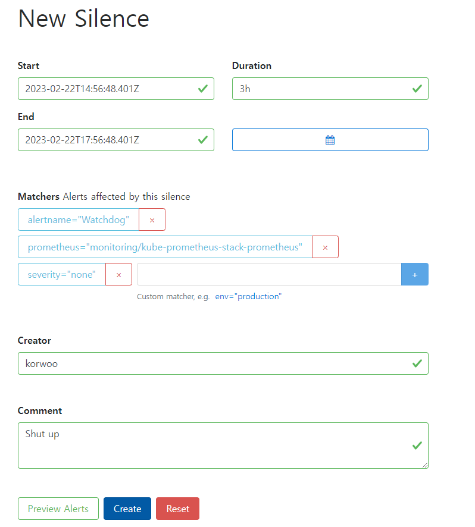
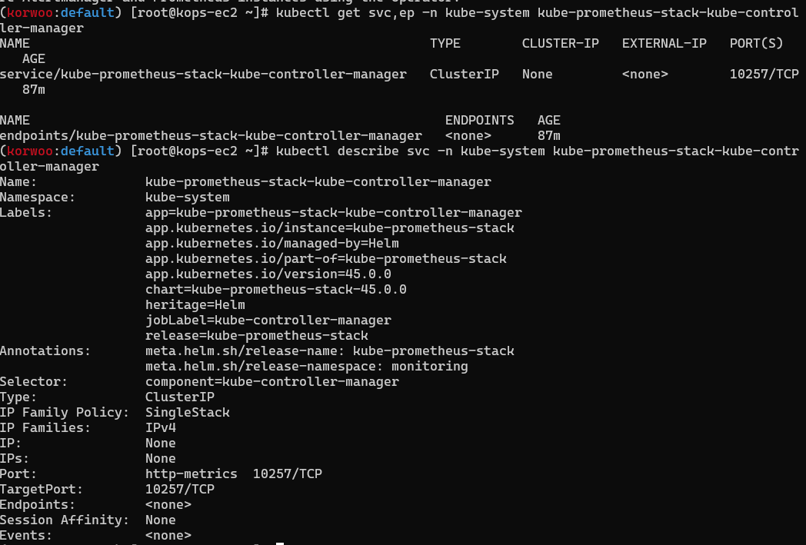
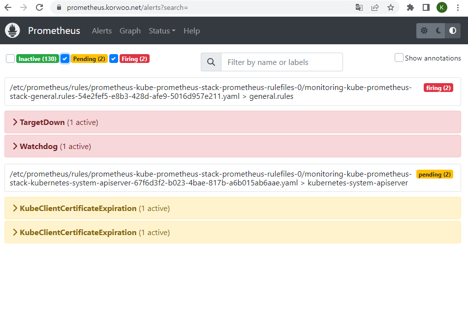

가시다님 스터디 : https://www.notion.so/gasidaseo/23-7635cc4f02c04954a3260b317588113e


본 포스팅은 가시다님의 쿠버네티스 스터디 내용과 이정훈님의 `24단계 실습으로 정복하는 쿠버네티스`
책을 참고하여 포스팅하였습니다.


# 6주차 Alert Manager Logging System


## 1. Alert Manager??

쿠버네티스를 학습하며 Prometheus, Grafana 등에대해서는 한번쯤은 들어봤지만
솔직히 AlertManager는 처음들어봤습니다..

AlertManager는 Prometheus의 특정 임계값을 넘거나 메트릭의 변화에 대한 알림을 slack, email 등으로 전송해주는 역할을 하는 친구입니다.

쉽게생각해 `Prometheus 에서의 알림 시스템 기능을 AlertManager로 분리시켰다` 라고 생각해주시면 되겠습니다.

개인적으로 왜 분리를 시켜두었는지 잘 이해가 되지 않네요..

참고로 Grafana v4.0 에서 Alert 기능이 추가되었다고 하는데 Alert Manager 의 미래가 어떻게 될지는 한번 지켜봐야 되지 않을까 싶습니다..


## 2. 실습환경 배포 중 이슈 발생




Rolling Update 수행 중 
I0222 22:24:12.336747    8250 instancegroups.go:533] Cluster did not pass validation, will retry in "30s": InstanceGroup "nodes-ap-northeast-2a" did not have enough nodes 0 vs 2.
의 오류메세지가 반복적으로 출력 되면서 Rolling Update가 정상적으로 수행되지 않는 이슈가 있었습니다.

롤링업데이트룰 중단하고 kops validate cluster 를 통해 확인해 보니 Validation Error가 발생한 상태이더군요..
워커노드 재생성또한 진행되지 않았습니다.
근데 또 노드의 상태는 정상적으로 표시가 되고
Prometheus, Grafana 등에서 값들은 정상적으로 받아오더군요..

요즘 핫한 ChatGPT에게 자문을 구해보았습니다.
처음에는 이친구가 제 질문을 이해를 못하고 이상한 소리만 해서 고생좀 했습니다만...
정리해가면서 질문을 계속 하니 제법 유용한 답변을 제공하였습니다.

첫번째는 클러스터 버전 호환성 문제이고
두번쨰는 AWS 리소스 제한 관련 이슈입니다.

AWS 리소스 제한이 제일 테스트해보기 쉬우니 테스트를 진행해보겠습니다.

테스트 진행중 ㅜㅜ


## 3. Prometheus, Grafana, Alert Manager 배포

실습환경을 셋팅하는 과정은 앞의 포스팅에서 계속해서 다뤘으므로 생략하도록 하겠습니다.

본 리소스들은 Helm을 이용하여 배포할것입니다.

```bash
kubectl create ns monitoring
helm repo add prometheus-community https://prometheus-community.github.io/helm-charts
```
위 명령어를 이용하여 Namespace 변경 및 Helm Chart를 다운받도록 하겠습니다.

```bash
cat <<EOT > ~/monitor-values.yaml

alertmanager:
  ingress:
    enabled: true
    ingressClassName: alb

    annotations:
      alb.ingress.kubernetes.io/scheme: internet-facing
      alb.ingress.kubernetes.io/target-type: ip
      alb.ingress.kubernetes.io/listen-ports: '[{"HTTPS":443}, {"HTTP":80}]'
      alb.ingress.kubernetes.io/certificate-arn: $CERT_ARN
      alb.ingress.kubernetes.io/success-codes: 200-399
      alb.ingress.kubernetes.io/group.name: "monitoring"

    hosts:
      - alertmanager.$KOPS_CLUSTER_NAME

    paths:
      - /*


grafana:
  defaultDashboardsTimezone: Asia/Seoul
  adminPassword: prom-operator

  ingress:
    enabled: true
    ingressClassName: alb

    annotations:
      alb.ingress.kubernetes.io/scheme: internet-facing
      alb.ingress.kubernetes.io/target-type: ip
      alb.ingress.kubernetes.io/listen-ports: '[{"HTTPS":443}, {"HTTP":80}]'
      alb.ingress.kubernetes.io/certificate-arn: $CERT_ARN
      alb.ingress.kubernetes.io/success-codes: 200-399
      alb.ingress.kubernetes.io/group.name: "monitoring"

    hosts:
      - grafana.$KOPS_CLUSTER_NAME

    paths:
      - /*

prometheus:
  ingress:
    enabled: true
    ingressClassName: alb

    annotations:
      alb.ingress.kubernetes.io/scheme: internet-facing
      alb.ingress.kubernetes.io/target-type: ip
      alb.ingress.kubernetes.io/listen-ports: '[{"HTTPS":443}, {"HTTP":80}]'
      alb.ingress.kubernetes.io/certificate-arn: $CERT_ARN
      alb.ingress.kubernetes.io/success-codes: 200-399
      alb.ingress.kubernetes.io/group.name: "monitoring"

    hosts:
      - prometheus.$KOPS_CLUSTER_NAME

    paths:
      - /*

  prometheusSpec:
    serviceMonitorSelectorNilUsesHelmValues: false
    retention: 5d
    retentionSize: "10GiB"
EOT

helm install kube-prometheus-stack prometheus-community/kube-prometheus-stack --version 45.0.0 -f monitor-values.yaml --namespace monitoring

```

다음 위의 명령어를 이용하여 YAML 파일을 생성하고 Helm Install 을 진행해주도록 하겠습니다.

각각의 접속 주소는
Grafana : grafana.본인도메인
Prometheus : Prometheus.본인도메인
AlertManager : alertmanager.본인도메인



위의 화면은 Prometheus에서 오류가 발생하고 있는 항목들 입니다.



오류가 발생하고 있는 항목들에 대해서 alertmanager 또한 동일하게 표시해주고 있는것을 확인하실 수 있습니다.

##4. Slack으로 WebHook 날려보기

이제 Slack 으로 WebHook을 날려보도록 하겠습니다.

```bash
https://hooks.slack.com/services/blabla/blabla/blabla
WEBHOOK='https://hooks.slack.com/services/blabla/blabla/blabla'

curl -X POST --data-urlencode "payload={\"channel\": \"#webhook\", \"username\": \"pkosbot\", \"text\": \"$KOPS_CLUSTER_NAME 다음주 종강! - 봇 제공\"}" $WEBHOOK
curl -X POST --data-urlencode "payload={\"channel\": \"#webhook\", \"username\": \"pkosbot\", \"text\": \"$KOPS_CLUSTER_NAME 다음주 종강! - 봇 제공\", \"icon_emoji\": \":ghost:\"}" $WEBHOOK

```

가시다님의 스터디채널의 미리 구성된 WebHook 채널에 WebHook을 날려보는 과정입니다.
WebHook URL은 본인의 Slack 채널의 WebHook URL을 입력해주시길 바랍니다.



WebHook이 정상적으로 날라가는군요!!

다음 Alert Manager에 WebHook URL 정보를 반영해보도록 하겠습니다.
```bash
cat <<EOT > ~/alertmanager-slack.yaml
alertmanager:
  config:
    global:
      resolve_timeout: 5m
      slack_api_url: 'https://hooks.slack.com/services/blabla/blabla/blabla'
    route:
      group_by: ['job']  # namespace
      group_wait: 10s
      group_interval: 1m
      repeat_interval: 5m
      receiver: 'slack-notifications'
      routes:
      - receiver: 'slack-notifications'
        matchers:
          - alertname =~ "InfoInhibitor|Watchdog"
    receivers:
    - name: 'slack-notifications'
      slack_configs:
      - channel: '#webhook'
        send_resolved: true
        title: '[{{.Status | toUpper}}] {{ .CommonLabels.alertname }}'
        text: |
          *Description:* {{ .CommonAnnotations.description }}
EOT

helm upgrade kube-prometheus-stack prometheus-community/kube-prometheus-stack --version 45.0.0 --reuse-values -f alertmanager-slack.yaml --namespace monitoring

```



Slack 에서 위에 Prometheus에서 확인했던 오류에 관한 내용이 전송된것을 확인하실 수 있습니다.
route.repeat_interval 이 5m으로 설정되어 있으므로 이슈를 해결하지 않는다면 5분마다 같은 메세지를 계속 날려줄것입니다.
5분마다 이슈 해결하라고 떠들어댄다고 생각하면 꽤나 씨끄러울거 같군요
AlertManager에서 silence 처리가 가능합니다.


AlertManager에 접속하셔서 오류를 보시면 옆에 Silence 메뉴가 있습니다. 접속해 줍시다.



Duration은 얼마나 silence를 지정할 것인지에 대한 것입니다. 시간과 Creator,  Comment 를 입력해주시고 Create 하면
이 이슈에 대해서는 지정한 시간동안 조용히 하고 있을것입니다ㅎㅎ

계속 이어서 Prometheus에서 감지되는 이슈중에 kube-controller-manager, kube-scheduler 에 대해서 자세히 보겠습니다.

```bash
kubectl get svc,ep -n kube-system kube-prometheus-stack-kube-controller-manager
kubectl describe svc -n kube-system kube-prometheus-stack-kube-controller-manager
```



Prometheus가 kube-controller-manager 에 접근을 할 때에는 Cluster IP로 접속을 하는데 위 화면에서 보시면
EndPoint가 존재하지 않아서 발생하는 이슈 입니다.

해결해보도록 하겠습니다.
```bash
kubectl label $(kubectl get pod -n kube-system -l k8s-app=kube-controller-manager -oname) -n kube-system component=kube-controller-manager

kubectl label $(kubectl get pod -n kube-system -l k8s-app=kube-scheduler -oname) -n kube-system component=kube-scheduler

```



Prometheus 에서 해당 이슈가 없어진 것을 확인하실 수 있습니다.


```toc

```


