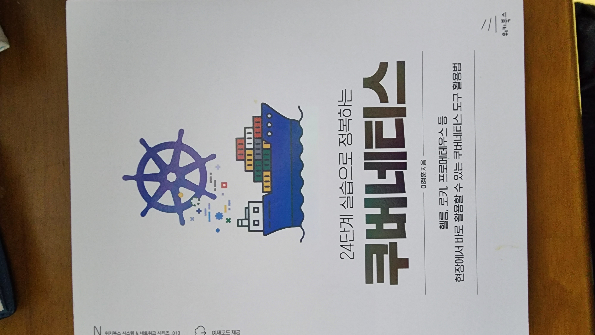
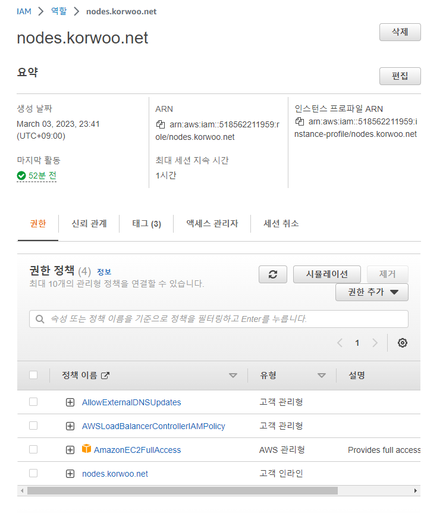
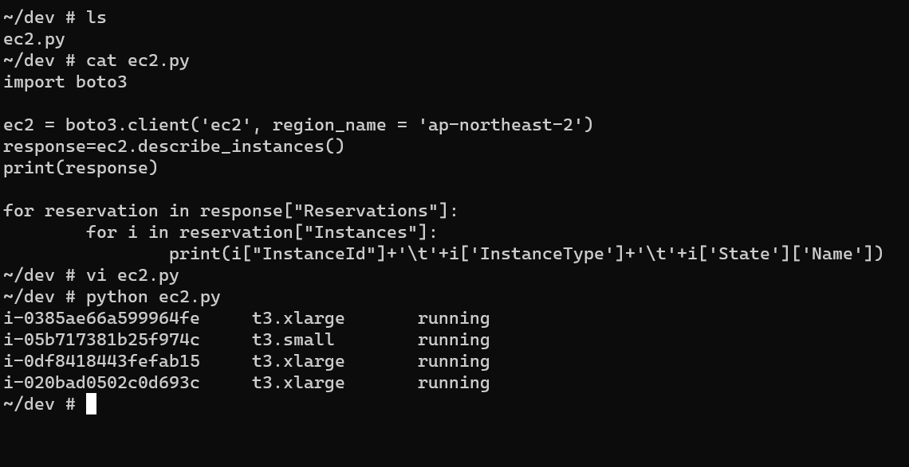
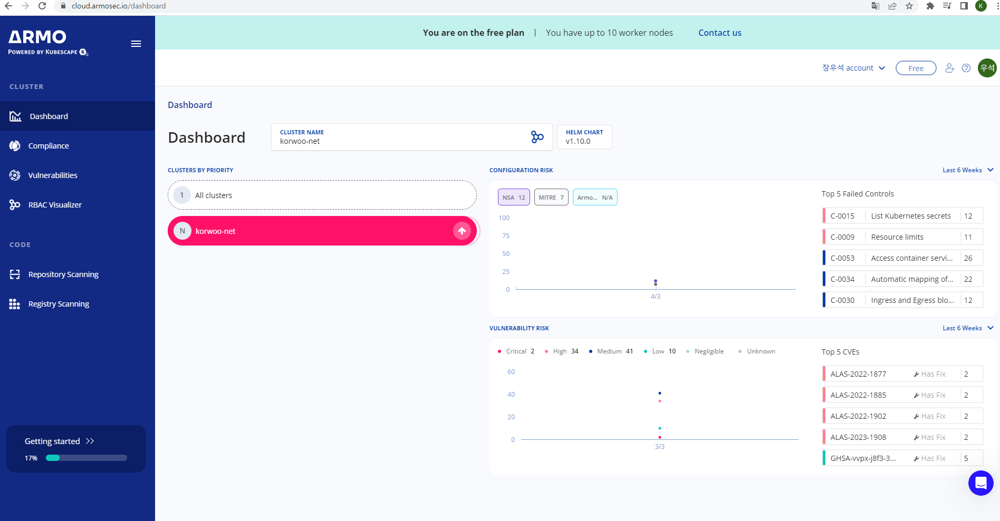
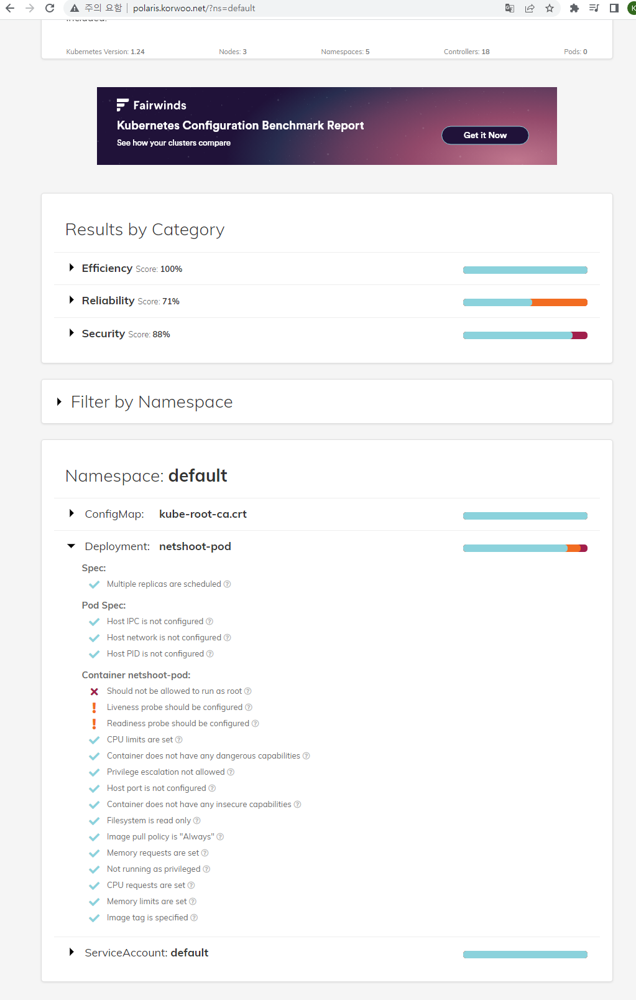
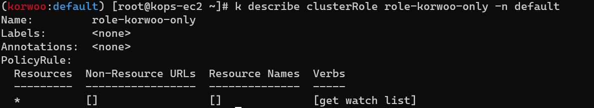
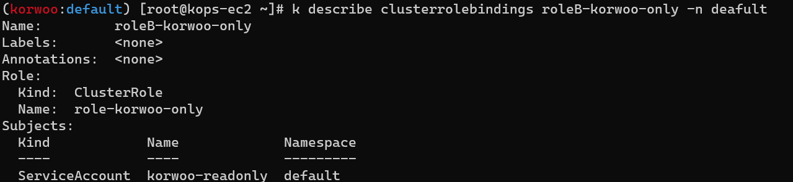
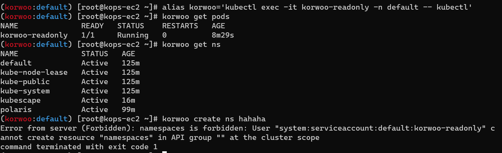

가시다님 스터디 : https://www.notion.so/gasidaseo/23-7635cc4f02c04954a3260b317588113e



본 포스팅은 가시다님의 쿠버네티스 스터디 내용과 이정훈님의 `24단계 실습으로 정복하는 쿠버네티스`
책을 참고하여 포스팅하였습니다.


# 7주차 Kubernetes 보안


## 1. Pod에서 EC2 메타데이터의 IAM Role Token 정보를 활용하여(boto3), 스터디에서 소개한 것 이외의 다른 AWS 서비스(혹은 Action)를 사용 후 코드 OR 스샷



Node에 EC2 Full Access 권한 부여



EC2 Instances 권한 획득 및 코드 실행 결과

코드를 실행하는 중
초기에는
ec2client=boto3.client('ec2') 라고 코드를 구성하였습니다.
그 결과 Module을 찾아오지 못하는 이슈가 있었습니다..ㅜㅜ
열심히 구글링 해본 결과 뒤에 Region을 붙여주는 예시코드를 찾아서 적용해본 결과 이슈가 없이 잘 작동하게 되었습니다.
아직도 왜 리전을 안 붙이면 모듈을 못찾아 오는지는 잘 모르겠네요.. 원인분석은 차근차근 해 보도록 하겠습니다

## 2. 교제 P 398 ~ P400 kubescape armo 웹 사용



## 3. polaris 관련 실습



## 4. 신규 서비스 어카운트(SA) 생성 후 클러스터 수준(모든 네임스페이스 포함)에서 읽기 전용 의 권한을 주고 테스트 

```bash
k get create sa korwoo-readonly -n default

cat <<EOF | kubectl create -f -
apiVersion: v1
kind: Pod
metadata:
  name: korwoo-readonly
  namespace: default
spec:
  serviceAccountName: korwoo-readonly
  containers:
  - name: kubectl-pod
    image: bitnami/kubectl:1.24.10
    command: ["tail"]
    args: ["-f", "/dev/null"]
  terminationGracePeriodSeconds: 0
EOF


cat <<EOF | kubectl create -f -
apiVersion: rbac.authorization.k8s.io/v1
kind: ClusterRole
metadata:
  name: role-korwoo-only
  namespace: default
rules:
- apiGroups: [""]
  resources: ["*"]
  verbs: ["get", "watch", "list"]
EOF

```


부여된 롤 확인
```bash
Role Binding 생성

cat <<EOF | kubectl create -f -
apiVersion: rbac.authorization.k8s.io/v1
kind: ClusterRoleBinding
metadata:
  name: roleB-korwoo-only
  namespace: default
roleRef:
  apiGroup: rbac.authorization.k8s.io
  kind: ClusterRole
  name: role-korwoo-only
subjects:
- kind: ServiceAccount
  name: korwoo-readonly
  namespace: default
EOF
```



부여된 롤 확인



부여된 롤 기반 권한 테스트


```toc

```


